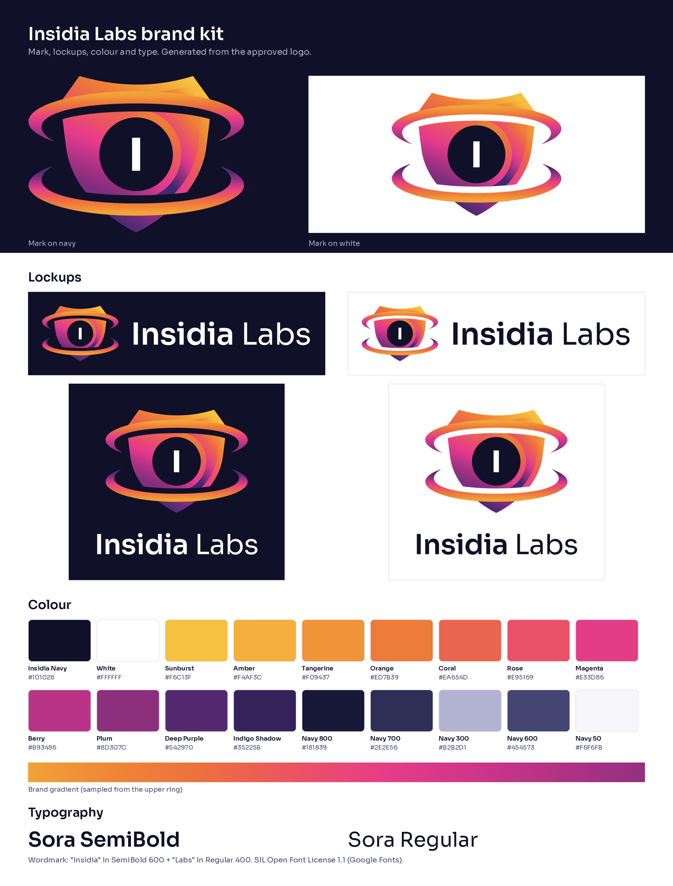

<p align="center">
  <picture>
    <source media="(prefers-color-scheme: dark)" srcset="brand/readme/hero-dark.png">
    
  </picture>
</p>

<p align="center">
  <a href="LICENSE"></a>
  
  
  
  
  <a href="https://insidialabs.com"></a>
</p>

<p align="center">
  <a href="#hand-it-to-your-agent"><b>Agent quickstart</b></a> ·
  <a href="#how-it-works"><b>How it works</b></a> ·
  <a href="#what-it-tests"><b>What it tests</b></a> ·
  <a href="#install"><b>Install</b></a> ·
  <a href="#open-source-and-insidia-cloud"><b>Insidia Cloud</b></a> ·
  <a href="plans/00-master-plan.md"><b>Roadmap</b></a>
</p>

<br>

AI apps fail in two places at once. The model layer leaks secrets, follows injected instructions, and misuses its tools. The app around it still has SQL injection, XSS, SSRF, and broken authorization. Attackers chain the two: a prompt injection makes an agent call a tool with a payload that a normal web scanner never gets to send.

**Insidia tests both layers in one run, on your own machine.** It drives the best open-source security engines, fills the gaps they leave with its own modules, scores you against an open benchmark, and hands you a single HTML report. Your coding agent can do all of it for you.

> [!NOTE]
> Insidia is pre-release. The CLI described here is being built now ([roadmap](plans/00-master-plan.md)). Early access to Insidia Cloud opens in December 2026 for three design partners. Write to [insidialabs@gmail.com](mailto:insidialabs@gmail.com) to take part.

## Hand it to your agent

Add the Insidia skill to any coding agent that supports skills (Claude Code, Cursor, Codex, and others):

```bash
npx skills add Rushi-Balapure/Insidia-Labs --skill insidia
```

Then ask:

```text
Test this app with Insidia. Only scan localhost, and open the report when you're done.
```

The agent installs the CLI, writes a scoped `insidia.yaml`, runs the scan, reads the findings, proposes fixes, and opens the report. You only confirm which hosts it may test. Agents that prefer tools over shell commands can use the MCP server instead: `insidia mcp`.

## How it works

<p align="center">
  <picture>
    <source media="(prefers-color-scheme: dark)" srcset="brand/readme/flow-dark.png">
    
  </picture>
</p>

## What it tests

<table>
<tr>
<th width="50%" align="left">AI and agent layer</th>
<th width="50%" align="left">Application layer</th>
</tr>
<tr>
<td valign="top">

- Direct and indirect prompt injection
- Jailbreaks and policy bypass
- System prompt and secret leakage
- Agent tool misuse and excessive agency
- RAG and memory poisoning, cross-tenant bleed
- MCP server and agent supply chain
- Unbounded consumption

</td>
<td valign="top">

- SQL injection, XSS, SSRF, and the rest of the web Top 10
- API flaws: BOLA/IDOR, BFLA, mass assignment, JWT
- GraphQL and gRPC endpoints
- Secrets in code and history
- Vulnerable dependencies and container images
- **Chains** that start in the AI layer and land in the app

</td>
</tr>
</table>

Every result maps to **OWASP LLM Top 10**, **OWASP Agentic Top 10**, **OWASP Web and API Top 10**, **MITRE ATLAS**, and **CWE**, so you can show what passed, not only what failed.

### The Insidia Benchmark

An open, versioned policy of security controls, each with the probes that test it and the oracle that decides pass or fail. Pick a level:

| Level | What it runs | When to use it |
| --- | --- | --- |
| **L1 Baseline** | Fast checks that need no model | Every pull request |
| **L2 Standard** | Adds judge-scored probes and authenticated web and API checks | Before a release |
| **L3 Thorough** | Every covering engine, plus multi-turn and model-generated attacks | Before launch and after big changes |

You get a score per framework and a badge for your README. Add your own controls in the same format.

### Built for any agent, any model, any OS

<table>
<tr>
<td width="50%" valign="top">
<b>Any agent</b><br>
A plain CLI with <code>--json</code> output and stable exit codes, an agent skill, and an MCP server. No agent framework required.
</td>
<td width="50%" valign="top">
<b>Any model</b><br>
Point the attacker and judge at any OpenAI-compatible endpoint (Ollama, llama.cpp, vLLM, LM Studio, OpenRouter), Anthropic, Gemini, Bedrock, Azure, or Insidia Cloud. Many checks need no model at all.
</td>
</tr>
<tr>
<td width="50%" valign="top">
<b>Any OS</b><br>
Linux, macOS, and Windows. Insidia installs the engines it needs, or runs them all from one Docker image.
</td>
<td width="50%" valign="top">
<b>Private by default</b><br>
Nothing leaves your machine except traffic to your target and to the model you chose. No telemetry.
</td>
</tr>
</table>

## Install

Insidia installs straight from this repository.

```bash
# uv (recommended)
uv tool install "git+https://github.com/Rushi-Balapure/Insidia-Labs#subdirectory=core"

# pipx
pipx install "git+https://github.com/Rushi-Balapure/Insidia-Labs#subdirectory=core"

# Docker, with every engine bundled
docker run --rm -it -v "$PWD:/work" ghcr.io/rushi-balapure/insidia scan
```

To pin a release, add its tag: `...Insidia-Labs@v0.1.0#subdirectory=core`. Each GitHub Release also ships a signed wheel for offline installs.

### Quickstart

```bash
insidia init           # find your app and write insidia.yaml with a safe scope
insidia doctor         # check engines and model endpoints
insidia scan           # run the L1 benchmark; add --policy L2 or L3 for more
insidia report --open  # open the HTML report
```

Insidia only scans hosts listed in your scope. Any host other than localhost needs an explicit `authorized: true` from you. In CI, `insidia scan` exits with `1` when the policy fails and writes SARIF for code scanning.

## Open source and Insidia Cloud

All of the code is open source under Apache-2.0, including Insidia Cloud. You can self-host everything. Teams pay us to run it.

<table>
<tr>
<th width="50%" align="left">Insidia CLI · free</th>
<th width="50%" align="left">Insidia Cloud · paid</th>
</tr>
<tr>
<td valign="top">

- Every engine and gap module, on your machine or CI
- Bring any model, or none
- Benchmark score, HTML report, SARIF, JSON
- Agent skill, MCP server, GitHub Action

</td>
<td valign="top">

- Hosted uncensored attacker and judge on our GPUs
- Custom attacks written for your app's domain and tools
- Adaptive multi-turn attacks and the AI pentest agent
- Dashboard to launch, schedule, and compare scans
- Team triage, history, compliance exports, runners for internal targets

</td>
</tr>
</table>

General-purpose models often refuse to write attacks. The report counts those refusals, so you can see which attack families were thin and whether a local uncensored model or Insidia Cloud would help.

## Repository

| Path | What it holds |
| --- | --- |
| [`core/`](core) | The `insidia` package: CLI, target adapters, model providers, engine adapters, gap modules, benchmark runner, report, MCP server |
| [`benchmark/`](benchmark) | Benchmark policies and framework mappings, plus the scanner benchmark: permutation matrix, sandboxed vulnerable targets, ground truth |
| [`skills/insidia/`](skills/insidia) | The agent skill |
| [`cloud/`](cloud) | Insidia Cloud: API, workers, pentest agent, model service, runner hub |
| [`runner/`](runner) | Go runner that connects Cloud scans to internal targets |
| [`dashboard/`](dashboard) | Hosted dashboard |
| [`site/`](site) | Marketing site (Astro on Vercel) |
| [`brand/`](brand/README.md) | Brand kit: logo, lockups, colors, favicons, fonts, README artwork |
| [`docs/`](docs), [`shared/`](shared), [`deploy/`](deploy), [`plans/`](plans) | Docs, protocol and SDK, deployment templates, roadmap |

`cloud/` is the Insidia Cloud service. `benchmark/` is the scanner benchmark and the framework mappings.

<details>
<summary><b>Development</b></summary>

<br>

Local stack:

```bash
docker compose -f deploy/compose/docker-compose.yml up --build
```

The API answers `http://127.0.0.1:8000/healthz`. The dashboard is `http://127.0.0.1:5173`. Dev endpoints and the dev master key exist only when `INSIDIA_DEV_MODE=true`.

Without Docker, from `cloud/`:

```bash
uv sync
uv run ruff check .
uv run mypy api workers
uv run pytest
```

Set `INSIDIA_TEST_DATABASE_URL` to a Postgres 18 superuser URL to run the row-level security tests.

Marketing site, from `site/`:

```bash
npm ci
npm run dev    # http://127.0.0.1:4321
npm test
npm run build
```

README artwork is HTML in `brand/readme/src/`. Edit it there and run `brand/readme/render.sh` to regenerate the PNGs.

</details>

<details>
<summary><b>Brand</b></summary>

<br>

<p align="center"></p>

Use the files in [`brand/`](brand/README.md) as they are. Never recolor, retype, stretch, or add effects to the mark or the wordmark. Primary colors are Navy `#101028`, Orange `#ED7B39`, and Magenta `#E33D86`; the typeface is Sora. On orange, use navy text. The full rules, palette, and contrast ratios are in [`brand/README.md`](brand/README.md) and [`brand/colors/palette.md`](brand/colors/palette.md).

</details>

## Credits

Insidia stands on these open-source projects. Each keeps its own license, and every finding in the report names the engine that produced it.

| AI and agent layer | Application layer | Pentest agent |
| --- | --- | --- |
| [garak](https://github.com/NVIDIA/garak) · Apache-2.0 | [ZAP](https://github.com/zaproxy/zaproxy) · Apache-2.0 | [Strix](https://github.com/usestrix/strix) · Apache-2.0 |
| [promptfoo](https://github.com/promptfoo/promptfoo) · MIT | [Nuclei](https://github.com/projectdiscovery/nuclei) · MIT | |
| [PyRIT](https://github.com/Azure/PyRIT) · MIT | [Dalfox](https://github.com/hahwul/dalfox) · MIT | |
| [DeepTeam](https://github.com/confident-ai/deepteam) · Apache-2.0 | [Trivy](https://github.com/aquasecurity/trivy) · Apache-2.0 | |
| [mcp-scanner](https://github.com/cisco-ai-defense/mcp-scanner) · Apache-2.0 | [osv-scanner](https://github.com/google/osv-scanner) · Apache-2.0 | |
| | [gitleaks](https://github.com/gitleaks/gitleaks) · MIT | |

The full list is in [THIRD_PARTY_NOTICES.md](THIRD_PARTY_NOTICES.md).

## License

[Apache-2.0](LICENSE). The Sora font in `brand/fonts/` is under the SIL Open Font License. The Insidia Labs name and logo are trademarks and are not part of that license; see [NOTICE](NOTICE).

<br>

<p align="center">
  <br>
  <sub>Built in Pune, India · <a href="mailto:insidialabs@gmail.com">insidialabs@gmail.com</a> · <a href="https://insidialabs.com">insidialabs.com</a></sub>
</p>
