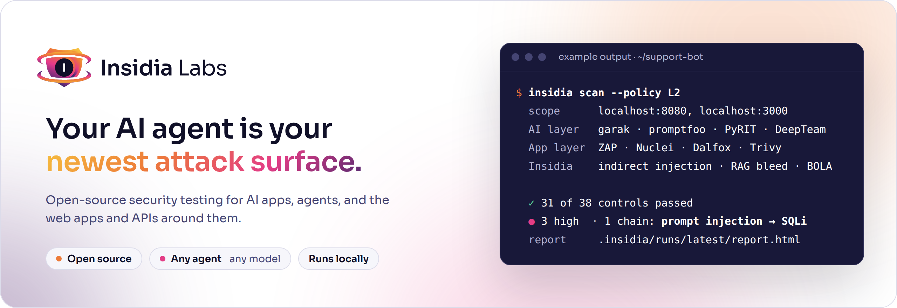

<p align="center">
  <picture>
    <source media="(prefers-color-scheme: dark)" srcset="brand/readme/hero-dark.png">
    
  </picture>
</p>

<p align="center">
  <a href="LICENSE"></a>
  
  
  
  <a href="https://insidialabs.com"></a>
  <a href="https://docs.insidialabs.com"></a>
</p>

<p align="center">
  <a href="#install"><b>Install</b></a> ·
  <a href="#quickstart"><b>Quickstart</b></a> ·
  <a href="#what-it-tests"><b>What it tests</b></a> ·
  <a href="#benchmark"><b>Benchmark</b></a> ·
  <a href="#insidia-cloud"><b>Insidia Cloud</b></a> ·
  <a href="https://docs.insidialabs.com"><b>Docs</b></a>
</p>

<br>

Insidia tests an AI app and the application around it in one local run. The model layer can leak secrets, follow injected instructions, and misuse tools. The app still has SQL injection, XSS, SSRF, and broken authorization. Attackers chain the two. A prompt injection can make an agent call a tool with a payload a normal web scanner never sends.

**Insidia is the free command-line tool for that job.** It runs open-source engines on your machine, fills the gaps they leave, scores the run against an open policy, and writes one HTML report. Nothing in a scan requires an account.

Install from GitHub today. A version tag publishes a signed wheel and a container image. [Insidia Cloud](#insidia-cloud), the hosted attacker, is not open yet.

## Install

Python 3.12 or newer. Install from this repository. Insidia is not on PyPI.

```bash
# uv (recommended)
uv tool install "git+https://github.com/Rushi-Balapure/Insidia-Labs#subdirectory=core"

# pipx
pipx install "git+https://github.com/Rushi-Balapure/Insidia-Labs#subdirectory=core"
```

Pin a commit or tag by adding it before the fragment: `...Insidia-Labs@<rev>#subdirectory=core`.

`insidia engines install` fetches the engine toolchains the scan needs. `insidia doctor` tells you what is missing. A version tag attaches a signed wheel and publishes `ghcr.io/rushi-balapure/insidia` with every pinned engine. See [the launch note](https://insidialabs.com/launch).

## Quickstart

From the project you want to test:

```bash
insidia init
insidia doctor
insidia scan --policy L1 --yes
insidia report --open
```

`insidia init` writes `insidia.yaml` with scope limited to localhost and a chat target at `http://127.0.0.1:8080/chat`. Edit the targets before you scan. `insidia scan` exits **0** when the policy passes and **1** when it fails. Add `--json` for a machine-readable result.

Insidia only scans hosts listed under `scope`. A host other than localhost needs `authorized: true`, which you set. Rate limits are on by default.

### Hand it to a coding agent

Paste this into Claude Code, Cursor, Codex, or any agent that can run a shell:

```text
Test this app with Insidia. Only scan localhost, and open the report when you're done.
```

You confirm the hosts. The agent should install the CLI, keep the scope you named, read `.insidia/runs/<run-id>/findings.json`, and open `report.html`. The skill is `skills/insidia/SKILL.md` (`npx skills add Rushi-Balapure/Insidia-Labs`). `insidia mcp` is the local MCP server. The CLI remains the contract: `--json`, `--yes`, and stable exit codes.

## What it tests

| AI and agent layer | Application layer |
| --- | --- |
| Direct and indirect prompt injection | Template injection, command injection, path access, and SSRF |
| Jailbreaks and policy bypass | BOLA/IDOR, BFLA, mass assignment, JWT |
| System prompt and secret leakage | Secrets in code and history |
| Tool misuse and excessive agency | Vulnerable dependencies and container images |
| RAG and memory poisoning, cross-tenant bleed | Scripted chains from the AI layer into the app |
| MCP and skill supply chain | |

Findings map to **OWASP LLM**, **OWASP Agentic**, **OWASP Web and API**, and **CWE** when the control has that mapping. MITRE ATLAS is not mapped yet. SQL injection and XSS are not separate checks yet. Each finding names the engine that produced it. A secret in evidence is masked, for example `[AWS_ACCESS_KEY len=20 fp=3f9a1c07]`.

### Coverage

| Mode | What runs |
| --- | --- |
| `standard` (default) | One engine per attack family, the highest-priority one |
| `thorough` | Every installed engine that covers the family. A finding seen by more than one engine names each engine. That is not independent confirmation |

```bash
insidia scan --policy L2 --coverage thorough --yes
```

A scan with no model still runs every check that does not need one. Checks that need a model are skipped and listed in `benchmark.json`. A skip is not a pass.

## Benchmark

`insidia scan --policy L1|L2|L3` runs the open Insidia Benchmark policy:

| Level | What it adds |
| --- | --- |
| **L1** | Baseline checks. No model. The default from `insidia init`. |
| **L2** | The same baseline as L1. Judge-scored checks are not a separate level yet. |
| **L3** | The same baseline as L1. Model-generated attacks are not a separate level yet. |

The run directory `.insidia/runs/<run-id>/` contains:

| File | Contents |
| --- | --- |
| `benchmark.json` | Policy name, pass or fail, control results, skips |
| `findings.json` | Findings, including engine, probe, severity, and taxonomy |
| `results.sarif` | SARIF for CI code scanning |
| `report.html` | One HTML file. `insidia report --open` opens it |

The same repository publishes the scanner matrix under [`benchmark/`](benchmark): sandboxed targets and planted ground truth. That matrix is how engine adapters are accepted. It is separate from the policy you run on your own app.

Point a model at any OpenAI-compatible endpoint, including Ollama, by listing it in `insidia.yaml` and adding that host to `scope`.

## Insidia Cloud

All of the code is Apache-2.0, including the Cloud service in [`cloud/`](cloud). The product you would pay for is hosted GPUs, the attacker and judge models, and the managed dashboard. That service is not open yet. Design-partner access is planned for December 2026. Write to [insidialabs@gmail.com](mailto:insidialabs@gmail.com).

Until then, every scan you can run is the free CLI, with a model you bring or with no model at all.

## Commands

```text
insidia init
insidia doctor
insidia engines list
insidia engines install [ENGINE ...] [--docker]
insidia policy list|show|validate
insidia scan [--policy L1|L2|L3] [--coverage standard|thorough] [--json] [--yes]
insidia report [run-id] [--open]
```

Shared flags: `--json`, `--yes`, and `--config` (default `insidia.yaml`).

## Repository

| Path | What it holds |
| --- | --- |
| [`core/`](core) | The `insidia` package: CLI, scope guard, adapters, engines, modules, report |
| [`benchmark/`](benchmark) | Policy data, framework mappings, scanner matrix, sandboxed targets |
| [`cloud/`](cloud) | Insidia Cloud API and workers. Not required to scan |
| [`site/`](site) | Marketing site |
| [`docs/`](docs) | Documentation site |
| [`brand/`](brand/README.md) | Logo, colors, and README artwork |

## Development

CLI, from `core/`:

```bash
uv sync
uv run ruff check .
uv run mypy insidia
uv run pytest
```

Marketing site, from `site/`:

```bash
npm ci
npm test
npm run dev    # http://127.0.0.1:4321
```

Docs, from `docs/`:

```bash
npm ci
npm run check
npm run dev
```

Cloud stack, when you are working on the hosted service:

```bash
docker compose -f deploy/compose/docker-compose.yml up --build
```

The API answers `http://127.0.0.1:8000/healthz`. Dev endpoints exist only when `INSIDIA_DEV_MODE=true`.

## Credits

Each project keeps its own license. The full notices are in [THIRD_PARTY_NOTICES.md](THIRD_PARTY_NOTICES.md).

| AI and agent layer | Application layer |
| --- | --- |
| [garak](https://github.com/NVIDIA/garak) · Apache-2.0 | [ZAP](https://github.com/zaproxy/zaproxy) · Apache-2.0 |
| [promptfoo](https://github.com/promptfoo/promptfoo) · MIT | [Nuclei](https://github.com/projectdiscovery/nuclei) · MIT |
| [PyRIT](https://github.com/Azure/PyRIT) · MIT | [Dalfox](https://github.com/hahwul/dalfox) · MIT |
| [DeepTeam](https://github.com/confident-ai/deepteam) · Apache-2.0 | [Trivy](https://github.com/aquasecurity/trivy) · Apache-2.0 |
| [mcp-scanner](https://github.com/cisco-ai-defense/mcp-scanner) · Apache-2.0 | [osv-scanner](https://github.com/google/osv-scanner) · Apache-2.0 |
| [SkillSpector](https://github.com/NVIDIA/SkillSpector) · Apache-2.0 | [gitleaks](https://github.com/gitleaks/gitleaks) · MIT |
| [NuGuard](https://github.com/NuGuardAI/nuguard) · Apache-2.0 | [Bandit](https://github.com/PyCQA/bandit) · Apache-2.0 |
| | [gosec](https://github.com/securego/gosec) · Apache-2.0 |

Also [katana](https://github.com/projectdiscovery/katana) and [httpx](https://github.com/projectdiscovery/httpx), both MIT.

## License

[Apache-2.0](LICENSE). The Sora font in `brand/fonts/` is under the SIL Open Font License. The Insidia Labs name and logo are trademarks and are not part of the Apache license. See [NOTICE](NOTICE).

Contributing and disclosure: [CONTRIBUTING.md](CONTRIBUTING.md), [SECURITY.md](SECURITY.md).

<br>

<p align="center">
  <br>
  <sub>Built in Pune, India · <a href="mailto:insidialabs@gmail.com">insidialabs@gmail.com</a> · <a href="https://insidialabs.com">insidialabs.com</a></sub>
</p>
