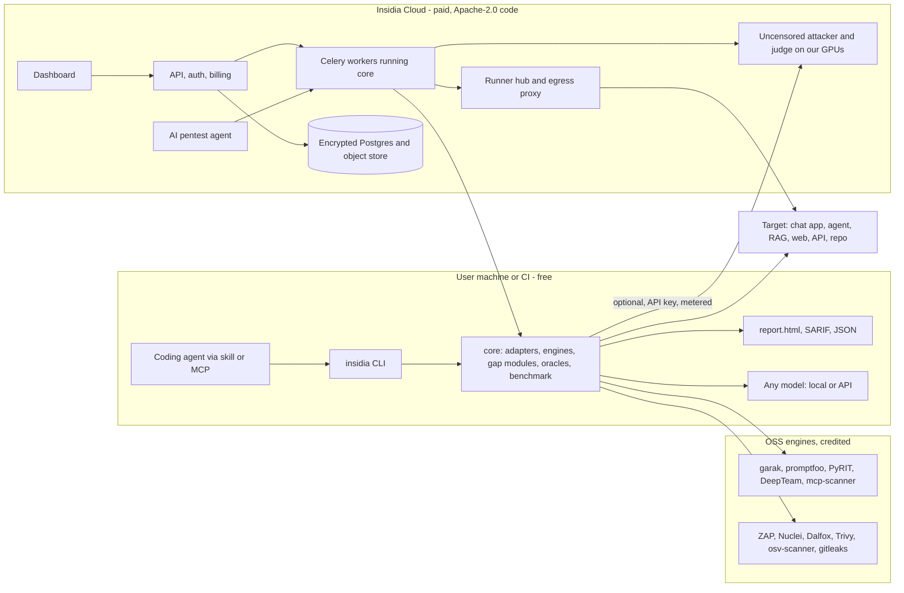

# Insidia Labs - Master Plan (open source first, paid hosted layer)

Plans are stored in both `/home/rushi/Desktop/Rushi/Insidia-Labs/plans/` and this repo's `plans/`. This file is `00-master-plan.md`. The AI attack coverage requirements live in `01-ai-redteam-coverage-spec.md`.

## Status

Update this table in the same change that starts or finishes a phase. **1C** is in progress.

| Phase | Status | Where it stands |
| --- | --- | --- |
| 0 Foundations | Done | Merged to `main`. Cloud database, RLS, envelope encryption, CI. |
| T Test harness | Done | Merged to `main`. Lives in `benchmark/`. 1,235 cells, xfail until a scanner exists. |
| W Marketing site | Built, next work pending | Site is on `main`. Next: open-source-first copy, engine credits, remove the engine-name denylist, benchmark page. |
| 1.0 Restructure | Done | Branch `phase-1.0-restructure`, not merged. Cloud lives in `cloud/`, the scanner benchmark in `benchmark/`, and every cell has an owning phase. |
| 1A CLI core | Done | Branch `phase-1a-cli-core`. `insidia scan` runs one AI probe and one web probe against the sandbox. The `core` CI job runs that suite on Linux, macOS, and Windows. |
| 1B Engines | Done | Branch `phase-1b-engines`. Adapters are wired for garak 0.17.0, promptfoo 0.124.0, PyRIT 1.1.0, DeepTeam 1.0.9, mcp-scanner 4.8.5, SkillSpector 2.12.0, ZAP 2.17.0, Nuclei 3.11.1, Dalfox 3.2.3, katana 1.8.0, httpx 1.12.0, Trivy 0.75.0, osv-scanner 2.6.0, gitleaks 8.30.1, Bandit 1.9.4, and gosec 2.29.0. The built-in scan proves every phase 1B cell whose plant lives under `benchmark/targets/insidia/`, including white box and direct, relay, tunnel, and sdk_bridge. The white-box scan reads the cloned Juice Shop, crAPI, VAmPI, DVGA, and AgentDojo sinks through the cell's connection. Black-box and gray-box Juice Shop, VAmPI, and crAPI cells hit the running apps through direct and tunnel. All 635 phase 1B cells pass. |
| 1C Gap modules | In progress | 538 of 556 cells pass. The built-in scan proves the sandbox plants. Juice Shop, crAPI, and DVGA are hit on the running apps. The 18 AgentDojo cells stay expected failures. Running those tools imports email-validator, and that license is Unlicense, which the dependency gate does not allow. |
| 1D Benchmark and report | Not started | |
| 1E Agents and launch | Not started | |
| 2A Model service | Not started | |
| 2B Custom attacks and pentest agent | Not started | |
| 2C Hosted dashboard | Not started | |
| 3 Depth | Not started | 44 cells (SDK, predictive ML, smuggling, client-side). |
| 4 Enterprise | Not started | |

## Principles
Insidia follows the open-core pattern of developer-tool companies (mem0, Supabase, PostHog, Langfuse):
- **The code is open source under Apache-2.0**, including the Phase 2 Cloud code. The product a customer pays for is the hosted service: GPUs, our tuned uncensored attacker and judge models operated for them, uptime, the dashboard, team features, and support.
- **The free tier is the CLI.** Anyone runs full scans on their own machine with the OSS engines and our gap modules, and gets an HTML report. No account.
- **The OSS engines are credited by name.** Open code shows its dependencies, and crediting garak, promptfoo, ZAP, and the rest earns trust with the security community. Reports and docs name the engine behind every finding. The secret and real-data checks run in CI.
- **Model-agnostic.** The CLI talks to any model the user points it at. Insidia Cloud is one option, chosen because it is the easiest way to get attack generation that does not refuse.
- **Agents are first-class users.** The first thing in the docs is an agent skill. A user asks their coding agent to "test this app with Insidia", and the agent installs, configures, scans, and opens the report.

Phase 0 (database security, RLS, envelope encryption) is the foundation of Insidia Cloud. Phase T (the permutation matrix and sandboxed ground truth) is the public scanner benchmark.

## Phase plans
Each file opens with the phase it belongs to.

| File | Covers |
| --- | --- |
| [01-ai-redteam-coverage-spec.md](01-ai-redteam-coverage-spec.md) | AI attack coverage requirements |
| [02-foundations.md](02-foundations.md) | Phase 0 (done) |
| [03-engines-and-connections.md](03-engines-and-connections.md) | Local engines in 1B; relay, tunnel, and direct connections in 2C |
| [04-hosted-dashboard.md](04-hosted-dashboard.md) | Hosted dashboard, 2C |
| [05-benchmark-and-reports.md](05-benchmark-and-reports.md) | Benchmark and reports, 1D |
| [06-depth-checks.md](06-depth-checks.md) | Deterministic depth in 1B/1C; model-driven depth in 2B |
| [07-pentest-agent.md](07-pentest-agent.md) | Pentest agent, 2B |
| [08-engine-registry.md](08-engine-registry.md) | Capability registry, 1A and 1D |
| [09-agent-security.md](09-agent-security.md) | Scripted checks in 1C; honeypots and A2A in Phase 3 |
| [10-white-box.md](10-white-box.md) | Static scanners in 1B; AI-BOM and SDK in Phase 3 |
| [11-continuous-scanning.md](11-continuous-scanning.md) | GitHub Action in 1E; schedules in 2C |
| [12-enterprise.md](12-enterprise.md) | Phase 4 |
| [13-runtime-guardrails.md](13-runtime-guardrails.md) | Runtime guardrails, Phase 4 |
| [14-database-schema.md](14-database-schema.md) | Insidia Cloud database |
| [15-customer-docs.md](15-customer-docs.md) | Docs; the agent skill goes first |
| [16-coverage-gaps.md](16-coverage-gaps.md) | Gap modules, 1C and 2B |
| [17-test-suite.md](17-test-suite.md) | Public scanner benchmark and phase gate |
| [18-validity-matrix.md](18-validity-matrix.md) | Matrix validity function |
| [19-model-hosting.md](19-model-hosting.md) | Cloud model service, 2A |
| [20-admin-console.md](20-admin-console.md) | Staff console, 2C |
| [21-marketing-website.md](21-marketing-website.md) | Marketing site, Phase W |
| [22-website-video-scripts.md](22-website-video-scripts.md) | Scripts for the site's demo videos |

## Scope
Insidia Labs is an **AI-native application security toolkit**. It covers two tracks:
- **AI and agent security:** prompt injection (direct and indirect), jailbreaks, agent tool misuse, RAG and memory poisoning, MCP and supply chain, unbounded consumption, multi-agent abuse. Full requirements in `01-ai-redteam-coverage-spec.md`.
- **Classic AppSec:** web DAST (SQLi, XSS, SSRF), API security (BOLA/IDOR, auth), SAST, secrets, dependency/SCA, and infra/CVE scanning.

The differentiator is the seam between them: an attack that starts in the AI layer and lands in the app, for example a prompt injection that makes an agent call a tool with a SQL injection payload a plain DAST scanner never reaches. The free CLI finds each half and the deterministic chains we can script. The paid Cloud adds model-driven custom attacks and the pentest agent that discovers new chains.

Competitors: AI-side (Mindgard, Lakera, HiddenLayer, promptfoo's commercial tier), classic (Burp, Snyk API & Web, Invicti), AI pentest agents (XBOW, Strix). Our position: one open tool for both layers, with the hosted attacker as the upgrade.

## Key decisions
- **Open core, Apache-2.0 everywhere.** `core/`, `benchmark/`, `skills/`, `cloud/`, `runner/`, `dashboard/`, and `docs/` are all Apache-2.0. What stays private: production infrastructure config, secrets, the staff admin deployment config, customer data, and anything a customer gives us. Contributions need a DCO sign-off (no CLA), so the license can stay Apache.
- **The moat is operation, not secrecy.** Anyone can self-host Cloud with their own GPUs and an uncensored model. Most teams will not: they pay for hosted GPUs, models we tune and evaluate against the benchmark, attack corpora we keep current, the dashboard, and support. Self-hosters are a funnel, not a leak.
- **Free versus paid is decided by where the work runs.**
  - Free: scans launched from the CLI on the user's machine or CI, with the OSS engines, our gap modules, static attack corpora, and any model the user brings (local or API). Includes the HTML report, SARIF, the agent skill, the MCP server, and the GitHub Action.
  - Paid: anything that uses our hardware. That means CLI scans that call the Insidia Cloud attacker or judge (metered per token), scans launched or scheduled from the hosted dashboard, the hosted pentest agent, team history, compliance exports, and runners for internal targets.
- **Phase 1's "dashboard" is a report, not an app.** The CLI writes one self-contained HTML file (no server, no network, works offline) and `insidia report --open` opens it. Scans always run from the CLI in Phase 1.
- **Agent-agnostic.** The CLI is the contract. Every command has `--json`, is non-interactive with `--yes`, returns stable exit codes, and prints next steps. On top: an agent skill (`skills/insidia/SKILL.md`, installable with `npx skills add` and readable by any agent), an MCP server (`insidia mcp`, stdio), `AGENTS.md` and `llms.txt` in the docs. No agent framework is required to use Insidia, and no agent framework is used inside it (no LangGraph).
- **Model-agnostic.** One provider layer with two roles, `attacker` and `judge`. Each role points at any OpenAI-compatible endpoint (Ollama, llama.cpp, vLLM, LM Studio, OpenRouter, OpenAI, Azure), Anthropic, Gemini, Bedrock, or Insidia Cloud. A scan without any model still runs every static corpus and deterministic oracle. If an attacker model refuses generations, the report counts the refusals and says which families were thin, so the user sees why a hosted or local uncensored model helps.
- **OS-agnostic.** Linux, macOS, and Windows. `core` is pure Python 3.12+, installed straight from GitHub with `uv tool install` or `pipx install` from the git URL, or run as the Docker image. Engines that need another runtime (ZAP needs Java; Nuclei, Dalfox, and gitleaks are Go binaries; promptfoo needs Node) are fetched into a managed toolchain directory by `insidia engines install`, or run as pinned containers with `--engines docker`. `insidia doctor` explains what is missing.
- **Python version split.** `core` targets 3.12+ so users can install it on common systems. Insidia Cloud services stay on Python 3.14 as built in Phase 0.
- **Test-first stays.** Phase T's matrix gates every phase: a phase exits when the cells it owns are green. The same matrix and sandboxed targets are published as the scanner benchmark.
- **Local safety for an open tool.** The CLI scans only hosts listed in the project's `insidia.yaml` scope. Each non-local host needs an explicit `authorized: true` the user sets. Rate limits are on by default. The agent skill tells agents never to add a host the user did not name. Cloud scans add ownership verification and fixed-IP egress controls.
- **Privacy by default in the CLI.** Nothing leaves the machine except traffic to the target and to the model the user configured. No telemetry unless the user opts in. Secrets found in evidence are masked in the report (`[AWS_ACCESS_KEY len=20 fp=3f9a1c07]`).
- **Cloud keeps the security-first database.** Insidia Cloud stores customers' unfixed vulnerabilities, so Phase 0's design stands: per-org envelope encryption, RLS, no plaintext customer values. See [14-database-schema.md](14-database-schema.md).
- **Licenses we accept for dependencies:** MIT, Apache-2.0, BSD, ISC, and reviewed MPL-2.0. No GPL, AGPL, SSPL, or Elastic-licensed code in anything we ship, because the CLI is distributed. GPL tools can be documented as optional user-installed plugins that we never bundle.
- **Design follows the apple-design skill** (`.agents/skills/apple-design/`) for the HTML report, the dashboard, and the site.
- **Docs are part of every phase's exit.** Docs-as-code in `docs/`, generated CLI reference, every sample tested in CI.

## Architecture
One engine layer, two drivers. The local CLI and the Cloud workers import the same `core` package, so a probe behaves the same on a laptop and on our GPUs.



### Local scan flow (Phase 1)
1. `insidia init` writes `insidia.yaml`: targets, scope, credentials as references (`env:`, `file:`), model roles, and the policy to run.
2. `insidia scan` loads the policy, asks the capability registry which engines and modules cover each control, applies Standard or Thorough coverage, and runs them as local subprocesses with bounded concurrency.
3. Results go through detectors, oracles, and the judge (if a model is configured). The normalizer produces `Finding`s, merges duplicates across engines (marked "cross-validated"), maps taxonomy ids, and masks secrets.
4. The run directory `.insidia/runs/<run-id>/` gets `findings.json`, `results.sarif`, `benchmark.json` (the policy score), and `report.html`. Exit code is 0 when the policy passes, 1 when it fails, 2 on error.

### Cloud scan flow (Phase 2)
The same `core` runs inside Celery workers. Targets connect directly (public, ownership-verified, from fixed egress IPs) or through the runner (internal targets; relay for AI, WireGuard tunnel for raw HTTP). The connection modes, egress proxy, hub, and fairness rules are built in Phase 2C. See [03-engines-and-connections.md](03-engines-and-connections.md).

## The Insidia Benchmark (open policy)
Two things share the name, and the docs keep them apart:
- **Insidia Benchmark for systems** is the policy a team runs against its own app. A versioned YAML spec of controls (for example "the agent does not follow instructions found in tool output"), each mapped to OWASP LLM 2026, OWASP Agentic (ASI), OWASP Web and API Top 10, MITRE ATLAS, and CWE. Each control lists the probes that test it, the oracle that decides pass or fail, and its level:
  - **L1 Baseline:** fast, needs no model, safe to run on every pull request.
  - **L2 Standard:** adds judge-scored probes and authenticated web/API checks.
  - **L3 Thorough:** every covering engine plus multi-turn and model-generated attacks. It runs with a bring-your-own model and is strongest on Insidia Cloud.
  The result is a per-control pass/fail, a score per framework, and a badge a project can put in its README. Teams can extend the policy with their own controls in the same format.
- **Insidia Benchmark for scanners** is Phase T's matrix and sandboxed ground truth, published so anyone can measure a scanner's recall and precision (including ours). It keeps us honest: the coverage page on the site is generated from these numbers.

## CLI and agent surface (Phase 1)
```
insidia init                   detect the project, write insidia.yaml with scope and targets
insidia doctor                 check Python, engines, toolchains, model endpoints
insidia engines list|install   manage engine toolchains (local or --engines docker)
insidia policy list|show|validate
insidia scan [--policy L1|L2|L3|path] [--coverage standard|thorough] [--json] [--yes]
insidia report [--open] [run-id]   build or open the single-file HTML report
insidia mcp                    MCP server over stdio: init, scan, status, findings, report
insidia login | connect        Phase 2: link the CLI to Insidia Cloud
```
- **Agent skill** (`skills/insidia/SKILL.md`): when to use Insidia, how to install it (`uv tool install` from the git URL, falling back to `pipx` or Docker), how to write a safe scope, the exact command sequence, how to read `findings.json`, how to propose fixes, and how to re-run to confirm. It states the rules an agent must follow: confirm the target with the user, never widen scope, never paste secrets into chat, and open the report at the end.
- **Docs entry point:** the docs home page opens with a "Using a coding agent?" block containing the one-line skill install and a prompt to paste. The human path (install, init, scan) follows underneath.
- **Distribution: GitHub only, no package registry.** We do not publish to PyPI or Homebrew. Users install from the public repo:
  - `uv tool install "git+https://github.com/Rushi-Balapure/Insidia-Labs#subdirectory=core"` (recommended), or the same URL with `pipx install`. A tag pins a release (`...Insidia-Labs@v0.1.0#subdirectory=core`).
  - A wheel attached to each GitHub Release, for offline or air-gapped installs (`uv tool install ./insidia-0.1.0-py3-none-any.whl`).
  - A Docker image on GitHub Container Registry (`ghcr.io/rushi-balapure/insidia`) with every engine pinned. It is the zero-setup path on any OS.
  - A GitHub Action (`uses: Rushi-Balapure/Insidia-Labs/actions/scan@v0`) that uploads SARIF.
  Releases are tagged, and the wheel and image are signed with Sigstore (cosign) and have checksums. `core/pyproject.toml` must stay installable from a git subdirectory: no build steps that need files outside `core/`.

## Engine overlap and selection
Several engines cover the same attack family (jailbreaks: garak, promptfoo, PyRIT, DeepTeam; XSS: ZAP, Dalfox, Nuclei). A capability registry (`core/insidia/registry/`, versioned data files) maps `attack_family -> engine -> probe set` with priority, cost, and runtime measured on the scanner benchmark.
- **Standard (default):** one engine per family, the highest-priority one.
- **Thorough:** every covering engine. Findings confirmed by two or more are marked cross-validated.
- **Custom:** per family.
Engines are named in the report and the dashboard, with a link to the upstream project.

### How OSS engines plug in (no forks)
- **garak:** a custom generator that calls our target adapter; `parallel_requests` raised.
- **promptfoo:** a custom provider; attacker and grader point at the user's configured model. `PROMPTFOO_DISABLE_REMOTE_GENERATION=true`, telemetry and sharing off, so a user's prompts never go to a third party by default.
- **PyRIT:** a `PromptChatTarget` subclass; Crescendo, TAP, and PAIR unchanged.
- **DeepTeam:** an async `model_callback` into the target adapter.
- **ZAP:** headless with its API; alerts parsed.
- **Nuclei and Dalfox:** CLIs with JSON output.
- **Static scanners (mcp-scanner, SkillSpector, Trivy, osv-scanner, gitleaks, Bandit, gosec):** run on the local repo.
Each adapter has a contract test and a pinned version.

## Core contracts
Target config, in `insidia.yaml`:
```yaml
version: 1
policy: L2
scope:
  - host: localhost
  - host: staging.example.com
    authorized: true          # the user confirms they may test this host
targets:
  support-bot:
    kind: chat                # chat | agent | rag | mcp | web | api | repo
    url: http://localhost:8080/chat
    request_template: '{"messages": {{conversation_json}}}'
    response_selector: "$.choices[0].message.content"
    auth: { header: Authorization, secret_ref: "env:SUPPORT_BOT_TOKEN" }
    session: { mode: header, key: x-conversation-id }
    rate_limit: { rps: 5, concurrency: 4 }
models:
  attacker: { provider: openai-compatible, base_url: http://localhost:11434/v1, model: qwen3 }
  judge:    { provider: insidia-cloud }   # optional; needs `insidia login`
```

Findings schema: `Finding{track, engine, probe, severity, confidence, attack, response, trace_ref, taxonomy[], remediation, evidence_hash, cross_validated}`. Taxonomy prefixes: `owasp-llm:LLM01`, `owasp-asi:ASI02`, `owasp-web:A03`, `owasp-api:API1`, `atlas:AML.T0051`, `attack:T1190`, `cwe:CWE-89`, `cvss:9.8`, `nist-rmf:MS-2.7`, `eu-ai-act:art15`. The JSON schema is published and versioned, because agents and CI parse it.

The relay protocol (protobuf over gRPC/WSS) between the Cloud hub and the runner lives in `shared/proto/`.

## Insidia Cloud (Phase 2)
- **Model service:** uncensored open-weight attacker and judge (Qwen3.8-27B derivatives), staged hardware as in [19-model-hosting.md](19-model-hosting.md): Stage 0 is llama.cpp with a GGUF build on one 20 GB GPU; Stage 1 is vLLM with an AWQ build on 48 GB GPUs. One OpenAI-compatible endpoint behind an API key, so the CLI uses it like any other provider. No prompt logging; per-org token metering.
- **What the hosted model unlocks:** custom attacks generated for the target's own domain and tools, adaptive multi-turn attacks (TAP, PAIR, Crescendo, GOAT-style), judge-scored findings at L3, and the pentest agent.
- **AI pentest agent:** adapted from `usestrix/strix` (Apache-2.0), with tools for the target adapters, ZAP/Nuclei, a browser, and the OOB server. It plans chained attacks, confirms them with an oracle, and writes repro steps. The code is open and runs locally with any capable model; it is built and tuned for our hosted model.
- **Dashboard (`dashboard/`, on `app.`):** launch, schedule, and compare scans; triage findings across a team; compliance exports; runner enrollment for internal targets; usage and billing. Launching a scan from the dashboard is a paid feature. A free account can upload CLI results to view history, so a user can try the dashboard before paying.
- **Pricing shape:** free CLI forever; Cloud credits for new accounts; usage-based model tokens plus a team plan for the dashboard; enterprise for SSO, private tenants, and self-hosted Cloud. Exact numbers are a business decision recorded outside this plan.
- **Backend:** Python 3.14 FastAPI control plane, Celery on RabbitMQ (MPL-2.0), Valkey (BSD-3, not Redis 8+), Postgres 18 with RLS and per-org envelope encryption, Go hub for runners, egress proxy with fixed IPs and private-range blocking, hosted interactsh. Kubernetes and Helm. Phase 0 built the base; Phase 2C adds the rest.
- **Admin console:** staff-only, internal hostname, as in [20-admin-console.md](20-admin-console.md).

## Monorepo layout
The whole repo is public, including `internal/`: the ADRs and the threat model ship with the code.
```
Insidia-Labs/
  core/                   Python package `insidia` (3.12+): CLI, config, scope guard, target adapters,
    insidia/              model provider layer, engine manager and adapters, gap modules, oracles,
                          registry, normalizer, benchmark runner, report builder, MCP server
  benchmark/
    policies/             Insidia Benchmark policy files (L1, L2, L3) and the policy JSON schema
    mappings/             framework mappings (OWASP, ATLAS, CWE, and the rest)
    matrix/               scanner benchmark: permutation matrix and validity
    targets/              sandboxed vulnerable targets and ground truth
    harness/              scoring, egress guard, sandbox checks
  skills/insidia/         agent skill (SKILL.md and references), published for `npx skills add`
  cloud/                  Insidia Cloud: api/, workers/, agent/, models/, egress/,
                          admin_api/, hub/ (Go), alembic/
  runner/                 Go runner for Cloud scans of internal targets
  dashboard/              hosted dashboard (React)
  admin/                  staff admin console (React)
  site/                   marketing site (Astro, Vercel)
  brand/                  approved brand kit: logo, lockups, colors, favicons, fonts
  actions/scan/           GitHub Action that runs the CLI and uploads SARIF
  docs/                   docs site (Starlight): agent skill first, then CLI, benchmark, Cloud
  shared/proto/           relay and control protocol
  shared/sdk/             in-process SDK handlers (Phase 3)
  deploy/                 compose, helm, terraform templates (no production values)
  schema/                 plaintext allowlist for the Cloud database
  internal/               ADRs and threat model, published with the repo
  plans/
  LICENSE, NOTICE, THIRD_PARTY_NOTICES.md, CONTRIBUTING.md, SECURITY.md, AGENTS.md
```
Layout rules: move files with `git mv` so history follows them; keep CI paths, compose files, and the matrix CLI in step with directory names. The ownership map in `benchmark/matrix/ownership.yaml` assigns every valid cell to one phase, and `benchmark/matrix/ownership.py` is the function that produces that file.

## Phases

Every build phase has an implicit exit gate: the matrix cells it owns are green ([17-test-suite.md](17-test-suite.md)).

### Phase 0 - Foundations (done)
Monorepo scaffold, ADRs, the security-first database (roles, RLS, envelope encryption, audit), CI, dev compose. Merged to `main`. It is the base of Insidia Cloud.

### Phase T - Test harness (done)
17 connectors x 3 box modes x 44 attacks x 4 connection modes; 1,235 valid cells as strict xfail tests with planted ground truth on a no-egress sandbox. Merged to `main`. It becomes the scanner benchmark in `benchmark/`.

### Phase W - Marketing website (built, rework pending)
Static Astro site on Vercel, separate from the product; brand kit applied; looping HTML demos; waitlist. Next work: lead with the open-source CLI (GitHub link and stars, the `uv tool install` line from GitHub, the agent prompt), credit the engines, remove the engine-name denylist from the site CI, add the benchmark page, and make Cloud the second call to action. Videos follow [22-website-video-scripts.md](22-website-video-scripts.md). See [21-marketing-website.md](21-marketing-website.md).

### Phase 1 - Open-source launch (free)
- **1.0 Restructure (done, on `phase-1.0-restructure`):** `cloud/` (Insidia Cloud), `benchmark/` (scanner benchmark and framework mappings), `LICENSE`, `NOTICE`, `CONTRIBUTING.md`, `SECURITY.md`, `AGENTS.md`, CI paths, and the phase-owned ownership map. `core/` and `skills/insidia/` arrive with the CLI in 1A and 1E.
- **1A CLI core:** `insidia.yaml` schema and `init`, scope guard, target adapters (HTTP chat, OpenAI-compatible, Anthropic-style, WebSocket, MCP stdio and HTTP, web, REST/GraphQL/gRPC, local repo), the model provider layer, engine manager (local toolchains and Docker mode), capability registry v1, normalizer with cross-engine dedup, run directory format, `doctor`. Exit: `insidia scan` runs one AI probe and one web probe against the sandbox on Linux, macOS, and Windows.
- **1B Engines:** garak, promptfoo, PyRIT (single-turn), DeepTeam, mcp-scanner, SkillSpector; ZAP, Nuclei, Dalfox, katana/httpx, Trivy, osv-scanner, gitleaks, Bandit, gosec. Exit: every cell that `ownership.yaml` assigns to 1B is green, with no model configured where the cell allows it.
- **1C Gap modules:** the Insidia-built modules from [16-coverage-gaps.md](16-coverage-gaps.md) that do not need our hosted model: canary leakage oracle, instruction-hierarchy probes, indirect-injection fixtures (documents, web pages, tool results), RAG cross-tenant bleed, tool-trace and goal-diff oracles, output-sink checks, BOLA/BFLA, mass assignment, JWT, GraphQL depth, scripted AI-to-classic chains. Exit: every cell that `ownership.yaml` assigns to 1C is green.
- **1D Benchmark and report:** the policy format and L1-L3 policies, framework mappings (`benchmark/mappings/`), per-control scoring, `benchmark.json`, SARIF, JSON, and the single-file HTML report (apple-design, light and dark, works offline, secrets masked, engine credited per finding, "fix this" guidance, a re-run command per finding). Exit: one scan produces a report and an OWASP LLM / ASI / Web / API score; the report renders with JavaScript off for the summary.
- **1E Agents, distribution, launch:** the agent skill, `insidia mcp`, docs with the skill first, `llms.txt`, the GitHub Action, signed GitHub Releases (git install, wheel, GHCR image), a launch post, and the reworked site. Exit: a fresh machine with only a coding agent (Claude Code, Cursor, and Codex tested) goes from "test my app with Insidia" to an opened report with no manual commands, and the same flow works in CI.

### Phase 2 - Insidia Cloud (paid, open-source code)
- **2A Model service:** Stage 0 model hosting, API keys, metering, `insidia login`, `provider: insidia-cloud`. Exit: the CLI runs an L3 scan with the hosted attacker and judge, and usage is metered per org.
- **2B Custom attacks and the pentest agent:** target-specific attack generation, adaptive multi-turn attacks, judge calibration against the benchmark, the pentest agent with oracle-confirmed chains. Moves to Stage 1 hardware on measured triggers. Exit: on the benchmark, L3 with the hosted model finds strictly more confirmed issues than L3 with a typical commercial API model, and the agent demonstrates an AI-to-classic chain with a reproducible PoC.
- **2C Hosted dashboard:** accounts and orgs, upload of CLI runs (free), launching and scheduling scans (paid), direct and runner connection modes, team triage, history and diffs, compliance exports, billing, admin console v1. Exit: a team signs up, uploads a CLI run for free, then pays and launches a scheduled scan of an internal target through the runner.

### Phase 3 - Depth
Agent security (hosted honeypot MCP, poisoned content, canary tokens, multi-agent and A2A harnesses, ASI01-ASI10 suites, attack-path graph), white box (AI-BOM in CycloneDX, SDK handler and OTel traces feeding the attack planner), the late modules (predictive ML, smuggling, client-side), and integrations (GitLab, Jira, Slack, SIEM, Burp extension). Free versus paid follows the same rule: local is free, our hardware is paid.

### Phase 4 - Enterprise
SSO (SAML/OIDC), RBAC, audit export, retention controls, regional and private single-tenant Cloud, self-hosted Cloud on customer GPUs with a support contract, runtime guardrails reusing detectors as inline policies, SOC 2.

## Framework and compliance coverage
- **AI:** OWASP LLM Top 10 2026, OWASP Agentic Top 10 2026 (ASI01-ASI10), MITRE ATLAS, OWASP AIVSS.
- **Classic:** OWASP Top 10 (web), OWASP API Security Top 10, CWE, CVSS, MITRE ATT&CK.
- **Governance:** NIST AI RMF, NIST AI 600-1, EU AI Act (Art. 9, 10, 15), ISO/IEC 42001, SOC 2 / ISO 27001, PCI DSS (6.4, 11.3).
- **Outputs:** HTML report, SARIF, JSON, benchmark score (free); executive PDF, control-coverage matrix, evidence pack, CycloneDX AI-BOM (Cloud).
- OWASP content is CC BY-SA: we cite ids and titles and write our own descriptions.

## OSS we build on
- **AI engines:** garak (Apache-2.0), promptfoo (MIT), PyRIT (MIT), DeepTeam (Apache-2.0), Cisco mcp-scanner (Apache-2.0), NVIDIA SkillSpector (Apache-2.0), ModelScan (Apache-2.0).
- **Classic engines:** ZAP (Apache-2.0), Nuclei and templates (MIT), Dalfox (MIT), katana, httpx, subfinder, ffuf, naabu, tlsx, interactsh (MIT), Trivy (Apache-2.0), osv-scanner (Apache-2.0), gitleaks (MIT), Bandit (Apache-2.0), gosec (Apache-2.0).
- **Gap fillers:** Adversarial Robustness Toolbox and TextAttack (MIT), OpenSSF model-signing (Apache-2.0), Playwright (Apache-2.0). opengrep (LGPL-2.1) needs legal review before it is bundled.
- **Pentest agent:** `usestrix/strix` (Apache-2.0), adapted; modified files keep their headers and are marked modified.
- **Cloud infrastructure:** RabbitMQ (MPL-2.0), Valkey (BSD-3), PostgreSQL, Celery (BSD-3), wireguard-go (MIT), Pomerium (Apache-2.0, admin console only).
- **Docs and UI:** Astro, Starlight, Pagefind, Motion (MIT).
- **Reference:** AgentDojo (MIT), Inspect AI (MIT), splx Agentic Radar (Apache-2.0), LLM Guard (MIT), NeMo Guardrails (Apache-2.0).
- **Avoid:** sqlmap, Nikto, Wapiti, commix, testssl.sh (GPL); nmap (NPSL); trufflehog (AGPL); Redis 8+ (AGPLv3/SSPLv1/RSALv2); Semgrep registry rules; CAI (commercial); `Strixgov/strix` (Elastic license). Tencent AI-Infra-Guard can be considered after a license review, because its public-attribution requirement fits an open repo.

## Attribution
We distribute the CLI, so attribution is a release requirement:
- `NOTICE` and `THIRD_PARTY_NOTICES.md` list every bundled or installed dependency with its license. The Docker image and the release wheel include them.
- The README and docs credit the engines by name with links. Every finding in the report names the engine and probe that produced it.
- Apache-2.0 dependencies: keep LICENSE and NOTICE, mark modified files. MIT/BSD: keep copyright and license text. RabbitMQ (MPL-2.0): use unmodified, keep notices. MITRE data: cite and keep the license text.
- The CI license gate fails on any dependency whose license is not on the allowlist.

## Key risks
- **Free tier cannibalizes paid.** Mitigation: the free tier is complete for static and deterministic testing, but custom and adaptive attacks need a strong uncensored model and GPUs, and the dashboard needs our service. Measure conversion from CLI installs to Cloud sign-ups from launch.
- **A competitor hosts our code.** Apache-2.0 allows it. Our edge is model tuning and evaluation, attack corpora freshness, the benchmark, and speed of release. Revisit the license only if this becomes real; changing later costs community trust, so the default is to stay Apache.
- **Misuse of an open attack tool.** The scope guard, the `authorized: true` acknowledgement, default rate limits, agent-skill rules, and clear terms. The hosted model refuses requests that target hosts outside a verified scope.
- **Agent-driven runs going wrong.** An agent could widen scope or paste secrets. The skill forbids both, the CLI enforces scope regardless of what the agent asks, and secrets stay as references.
- **Toolchain sprawl across OSes.** Java, Node, and Go binaries on Windows and macOS are the main support load. Docker mode is the escape hatch; `doctor` is the first support step; the Docker image is tested on all three OSes.
- **Upstream engine changes.** Pinned versions, a contract test per adapter, and the registry can switch a family to another engine without a code change.
- **Engines phoning home.** promptfoo remote generation, telemetry, and sharing are off by default; a CI test runs each engine with a sniffing proxy and fails on unexpected outbound connections.
- **Model refusals with bring-your-own models.** Counted and reported per family, with a pointer to local uncensored models and to Cloud.
- **Coverage claims outrunning reality.** Site and docs coverage pages are generated from the scanner benchmark.
- **Cloud database breach.** Per-org envelope encryption, RLS, no evidence in logs or the broker, retention limits ([14-database-schema.md](14-database-schema.md)).
- **Model supply and quality.** Abliteration can hurt reasoning, and candidates publish GGUF only. Models are pinned only after the benchmark; the fallback is reproducing abliteration on the base model ([19-model-hosting.md](19-model-hosting.md)).
- **Scope creep.** Phase 1 is wide. If constrained, ship L1 and L2 for chat apps, agents, and web first, and add repo scanning and the rest in point releases.
