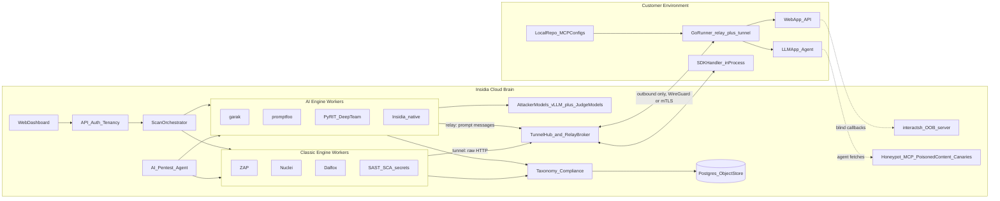

# Insidia AI Security Platform - Master Plan (v4: dual-track, multi-tenant cloud brain + thin runner)

Plans are stored in both `/home/rushi/Desktop/Rushi/Insidia-Labs/plans/` and this repo's `plans/`. This file is `00-master-plan.md`. The AI attack coverage requirements live in `01-ai-redteam-coverage-spec.md`.

## Phase plans
- [02-phase0-foundations.md](02-phase0-foundations.md)
- [03-phase1-vertical-slices.md](03-phase1-vertical-slices.md) (tracks 1A and 1B)
- [04-phase2-dashboard.md](04-phase2-dashboard.md)
- [05-phase3-taxonomy-compliance.md](05-phase3-taxonomy-compliance.md)
- [06-phase4-depth.md](06-phase4-depth.md) (tracks 4A and 4B)
- [07-phase5-pentest-agent.md](07-phase5-pentest-agent.md)
- [08-phase6-native-engine.md](08-phase6-native-engine.md)
- [09-phase7-agent-security.md](09-phase7-agent-security.md)
- [10-phase8-whitebox.md](10-phase8-whitebox.md)
- [11-phase9-continuous.md](11-phase9-continuous.md)
- [12-phase10-enterprise.md](12-phase10-enterprise.md)
- [13-phase11-later.md](13-phase11-later.md)

## Scope
Insidia is an **AI-native application security platform**. It covers two tracks, built in parallel:
- **AI/agent security:** prompt injection, jailbreaks, agent tool misuse, RAG and memory poisoning, supply chain, unbounded consumption, multi-agent abuse. Full requirements in `01-ai-redteam-coverage-spec.md`.
- **Classic AppSec:** web DAST (SQLi, XSS, SSRF), API security (BOLA/IDOR, auth), SAST, secrets, dependency/SCA, and infra/CVE scanning.

The differentiator is the seam between them: an AI pentest agent that chains an AI attack into a classic exploit, for example a prompt injection that makes an agent call a tool with a SQL injection payload that a plain DAST scanner would never reach. Competitors sit on one side only: Mindgard, Lakera, HiddenLayer (AI) vs Burp Enterprise, Snyk API & Web, Invicti (classic). XBOW and Strix are the closest on the AI-pentest-agent side.

## Key decisions
- **Architecture:** a cloud brain plus a thin runner, the model Mindgard and Lakera Red use. All attack generation, engines, judging, and mapping run in our cloud. The customer runs only a small relay/tunnel near the target. IP stays server-side.
- **Runner has two modes.** Relay mode sends one prompt at a time using the target's request template (AI attacks). Tunnel mode is an outbound WireGuard tunnel so cloud DAST scanners can send raw HTTP to internal apps, the model Snyk API & Web (Farcaster) uses.
- **Runner language:** Go. Single static binary, small footprint, harder to reverse-engineer.
- **Cloud brain language:** Python 3.14. Engines that don't yet support 3.14 run isolated in their own containers on their own Python, so the control plane can move ahead.
- **Multi-tenant, one brain, many runners.** A single shared cloud brain serves all customers. Each customer has many runners; the brain scans them all. Tenant isolation, fair scheduling, and per-tenant quotas are built in from Phase 1, not retrofitted.
- **Orchestration:** Celery for the job/task layer.
- **No free/local/BYOK mode.** We pay for and operate the attacker and judge models.
- **Closed source, MIT/Apache OSS only.** The backend stack is **confidential**: we do not publicly reveal which OSS engines we use. See "Confidentiality of the stack" below for the licensing constraints this imposes.
- **OSS strategy:** first *wrap* engines via their pluggable interfaces, then *port* the valuable content into a native Insidia engine. The port (Phase 6) also reduces external fingerprints (banners, default templates, error strings) that would otherwise reveal the underlying tools.
- **Desktop app deferred.** The web dashboard is the primary UI.
- **Enterprise data concerns** handled with regional instances, private single-tenant deployments, and an on-prem deployment of the cloud brain, so the brain is containerized from day one.

## Architecture



### Scan flow
1. A user creates a scan: target, mode (black/gray/white box), and profile, e.g. "OWASP LLM Top 10 2026" or "OWASP Web Top 10".
2. The orchestrator plans jobs and starts the relevant AI or classic worker containers.
3. **AI workers** use a RelayTarget plugin that publishes `{scan_id, attempt_id, session_id, conversation}` to the broker and waits for the reply.
4. **Classic workers** send raw HTTP through the tunnel hub into the runner's WireGuard tunnel, reaching only allowlisted hosts.
5. The runner (relay) applies the request template and selector, calls the target, redacts, and replies; or (tunnel) proxies HTTP to the internal app.
6. Detectors, oracles, and the judge score results. The normalizer produces `Finding`s, tagged by the taxonomy layer, and stored.

### How OSS engines plug in (no forks)
- **garak:** custom generator (`insidia.RelayGenerator`); raise `parallel_requests` to hide relay latency.
- **promptfoo:** custom provider (`file://relay_provider`) implementing `callApi`; attacker and grader point at our model service; `PROMPTFOO_DISABLE_REMOTE_GENERATION=true`, `PROMPTFOO_DISABLE_TELEMETRY=1`, `PROMPTFOO_DISABLE_SHARING=1`.
- **PyRIT:** `PromptChatTarget` subclass; multi-turn orchestrators (Crescendo, TAP, PAIR) unchanged.
- **DeepTeam:** async `model_callback` awaiting the relay.
- **ZAP:** run headless with its API; configure its proxy to egress through the tunnel; parse alerts.
- **Nuclei / Dalfox:** run as CLIs pointed at the tunneled target; parse JSON output; templates updated centrally.
- **Static scanners (mcp-scanner, SkillSpector, Trivy, osv-scanner, gitleaks):** the runner collects artifacts and uploads them redacted; the cloud scans.

## Core contracts (Phase 1, versioned)

Relay protocol (protobuf over gRPC/WSS):
```protobuf
message AttemptRequest { string scan_id = 1; string attempt_id = 2; string session_id = 3;
  repeated Turn conversation = 4; map<string,string> vars = 5; int32 timeout_ms = 6; }
message AttemptResponse { string attempt_id = 1; string output = 2; int32 status = 3;
  int64 latency_ms = 4; bytes raw_ref = 5; string error = 6; bool redacted = 7; }
message RunnerHello { string runner_id = 1; string version = 2; repeated string target_ids = 3;
  repeated string allowlist_hosts = 4; repeated Mode modes = 5; }  // Mode: RELAY, TUNNEL
```

Target config (stored in cloud; credentials resolved only on the runner):
```yaml
target: support-bot-staging
runner: runner-blr-01
mode: relay            # or tunnel for web/API targets
transport: http
request_template: '{"messages": {{conversation_json}}, "user": "insidia"}'
response_selector: "$.choices[0].message.content"
auth: { header: "Authorization", secret_ref: "env:SUPPORT_BOT_TOKEN" }
session: { mode: cookie | header | body_field, key: conversation_id }
rate_limit: { rps: 5, concurrency: 8 }
```

Findings schema: `Finding{track, engine, probe, severity, confidence, attack, response, trace_ref, taxonomy[], remediation, evidence_hash}`. The `engine` field is **internal only** and is never exposed in the UI, reports, or API; external `probe` names use our own naming, not the upstream engine's. Taxonomy prefixes: `owasp-llm:LLM01`, `owasp-asi:ASI02`, `owasp-web:A03`, `owasp-api:API1`, `atlas:AML.T0051`, `attack:T1190`, `cwe:CWE-89`, `cvss:9.8`, `nist-rmf:MS-2.7`, `eu-ai-act:art15`, `pci:6.4`.

## Go runner design
- **Modes:** relay (AI, one prompt at a time) and tunnel (userspace WireGuard for raw HTTP).
- **Commands:** `enroll`, `run` (daemon), `scan` (one-shot CI), `validate`, `discover`, `extract`.
- **Enrollment:** one-time token exchanged for a per-runner mTLS cert; auto-reconnect with backoff; heartbeat.
- **Transports (relay):** HTTP/REST, WebSocket, OpenAI-compatible, Anthropic, Bedrock, Azure OpenAI, raw Burp-style template.
- **Tunnel:** userspace WireGuard (no root), host allowlist enforced runner-side so the cloud reaches only approved targets.
- **Secrets** resolved only on the runner (env, file, Vault); never sent to cloud.
- **Safety:** per-runner host allowlist, global rate limits, cloud kill switch, local audit log, target ownership verification.
- **Redaction:** customer-configurable regex/entity rules applied before responses leave the runner.
- **Extract (white box):** tree-sitter parse of the local repo; uploads only artifacts (prompts, tool schemas, agent graphs, dependency manifests, MCP/skill configs).
- **Distribution:** cosign-signed binaries, Docker image, Helm chart, Homebrew/apt/winget.

## Cloud brain design
- **Control plane:** Python 3.14 FastAPI modular monolith. Modules: tenancy, targets, scans, findings, taxonomy, compliance, reports, runners, agent, billing.
- **Orchestration (Celery):** the API enqueues Celery tasks; workers pull from queues and shell out to the engine subprocesses. A scan is a Celery canvas: a `chord` of per-probe/per-batch `group` tasks with a finalizer that aggregates and scores. Chunk work into many small tasks (per probe or per attempt batch) for retry, progress, and fairness rather than one long task per scan.
  - **Broker/backend:** Redis to start (broker + result backend + progress pub/sub); RabbitMQ as the broker later if we need stronger delivery guarantees.
  - **Queues by engine type and priority:** e.g. `ai.fast`, `ai.heavy` (garak/PyRIT), `classic.dast` (ZAP/Nuclei), `static`, `agent`, `reports`. Dedicated worker pools per queue, autoscaled on queue depth.
  - **Engine execution:** one container image per engine (garak, a Node image for promptfoo, PyRIT/DeepTeam, native, ZAP, Nuclei/Dalfox, SAST/SCA), each on its own Python where needed. Celery workers run inside these images.
- **Tunnel hub + relay broker:** Go service holding runner connections; routes by runner/target; backpressure, timeouts, retries; WireGuard termination. Celery tasks reach targets only through the hub.
- **Models:** attacker models self-hosted on vLLM (commercial APIs refuse attack generation); judge models mixed commercial/self-hosted; per-scan cost tracking.
- **OOB server:** hosted interactsh for blind SQLi/SSRF/RCE callback confirmation.
- **Storage:** Postgres for metadata/findings; S3-compatible object store for transcripts/evidence, encrypted per tenant.
- **Web:** React (Vite) + TypeScript + Tailwind + shadcn/ui; live progress over WebSocket (fed by worker progress events on Redis pub/sub).
- **Deployment:** Kubernetes + Helm; Terraform for our cloud; same charts for private tenants and on-prem.

## Multi-tenancy and fair scheduling (one brain, many customers)
- **Identity:** every row, task, object-storage key, and log line carries `org_id` (and `project_id`). Postgres row-level security enforces isolation; object storage is prefixed and encrypted per tenant.
- **Task envelope:** every Celery task carries `{org_id, project_id, scan_id}`. A middleware sets the tenant context and the DB session role from it.
- **Fairness (Celery has no built-in fair scheduling):** one noisy customer must not starve others. Approach:
  - Per-org concurrency caps and token-bucket rate limits enforced at dispatch (a Redis-backed gate before a task is allowed to run).
  - A dispatcher that round-robins across orgs with queued work rather than draining one org's tasks first.
  - Per-org and per-scan budgets (max attempts, max tokens, max wall-clock); exceeding a budget pauses the scan, not the worker.
- **Isolation of blast radius:** target host allowlists are per-runner and per-org; the tunnel hub refuses cross-org routing; interactsh callbacks are keyed per scan.
- **Quotas and metering:** attempts, model tokens, and tunnel bytes are metered per org for billing and for enforcing plan limits.
- **Noisy-neighbor safety:** large enterprises can later be pinned to dedicated worker pools or a private tenant (Phase 10) without code change, because the tenant context already exists.

## Monorepo layout
Three distinct top-level components: `runner/` (Go, on the customer side), `engine/` (the cloud brain), and `dashboard/` (the web UI). Shared and ops files sit alongside.
```
Insidia-Labs/
  runner/                 Go thin runner (relay + tunnel); the only distributed component
  engine/                 the cloud brain
    api/                  FastAPI control plane (Python 3.14): tenancy, targets, scans, findings, taxonomy, compliance, reports, runners, billing
    workers/              Celery workers
      ai/                 garak, promptfoo, pyrit, deepteam, native
      classic/            zap, nuclei, dalfox, sast, sca
      static/             mcp/skill/model/deps scanners
      common/             task envelope, tenant context, fairness/dispatch, progress events
    agent/                AI pentest agent (Strix-based orchestrator)
    hub/                  Go tunnel hub + relay broker
    models/               vLLM configs, judge prompts (proprietary)
    taxonomy-data/        YAML framework mappings
  dashboard/              React (Vite) web app
  shared/
    proto/                relay + control protocol (used by runner, hub, engine)
    sdk/python, sdk/js    in-process handler + OTel instrumentation
  deploy/                 helm/, terraform/, docker-compose (dev)
  THIRD_PARTY_NOTICES.md  internal only
```
Note: `engine/hub/` is Go while the rest of `engine/` is Python; it is grouped under the brain because it is server-side infrastructure, not a customer artifact.

## Framework and compliance coverage
- **AI:** OWASP LLM Top 10 2026 (LLM01-LLM10), OWASP Agentic Top 10 2026 (ASI01-ASI10), MITRE ATLAS (v2026.06), OWASP AIVSS scoring, OWASP DSGAI.
- **Classic:** OWASP Top 10 (web), OWASP API Security Top 10, CWE 4.20, CVSS, MITRE ATT&CK v19.1.
- **Governance:** NIST AI RMF, NIST AI 600-1, EU AI Act (Art. 9, 10, 15), ISO/IEC 42001, CSA AICM, SOC 2 / ISO 27001, PCI DSS (6.4, 11.3).
- **Outputs:** executive PDF, technical HTML, control-coverage matrix, evidence pack (transcripts + hashes), SARIF, JSON, CycloneDX AI-BOM.
- OWASP content is CC BY-SA; we reference IDs/titles and write our own descriptions.

## OSS reuse (MIT/Apache only)
- **AI engines (wrap then port):** garak (Apache), promptfoo (MIT), PyRIT (MIT), DeepTeam (Apache), Cisco mcp-scanner (Apache), NVIDIA SkillSpector (Apache), ModelScan (Apache).
- **Classic engines:** ZAP (Apache), Nuclei + templates (MIT), Dalfox (MIT), katana/httpx/subfinder/ffuf (MIT), interactsh (MIT), Trivy (Apache), osv-scanner (Apache), gitleaks (MIT), Bandit (Apache), gosec (Apache).
- **AI pentest agent:** `usestrix/strix` (Apache 2.0) - port as the orchestrator that drives both tracks and validates exploits. PentAGI (MIT code, EULA) as reference only.
- **Reference / rules:** splx Agentic Radar (Apache), AgentDojo (MIT), Inspect AI (MIT), Pipelock (Apache), LLM Guard (MIT), NeMo Guardrails (Apache). (Tencent AI-Infra-Guard is excluded from the shipped stack; see below.)
- **Runner transport reference:** Praetorian Augustus (Apache, Go); Probely Farcaster agent (for the WireGuard tunnel design).
- **Avoid:** GPL/copyleft (sqlmap GPLv2, Nikto, Wapiti, commix; nmap NPSL) for on-prem distribution; Semgrep registry rules (competing-SaaS restriction); CAI (commercial license); `Strixgov/strix` (Elastic license, different project); Snyk agent-scan (proprietary service).
- **Excluded because it forces public attribution:** Tencent AI-Infra-Guard's code/engine requires an "About" page credit, which conflicts with keeping the stack confidential. We do **not** ship its code. We may still read its public rules as research and reimplement equivalents independently.
- **Porting rules:** keep upstream LICENSE/NOTICE and copyright headers *in our internal source tree*, mark modified files, pin versions, add a contract test per adapter.

## Confidentiality of the stack
We do not want to disclose that garak, promptfoo, ZAP, Nuclei, Strix, etc. run in our backend. This is legally workable, but only under specific conditions:
- **SaaS use is not "distribution".** MIT and Apache 2.0 attach their notice obligations to *distributing copies* of the software. Running these tools server-side in our cloud is not distribution, so no public disclosure is required. We still keep the LICENSE/NOTICE files in our private source tree.
- **Apache 2.0 patent/NOTICE terms** only require propagating NOTICE content when we distribute. Cloud-only engines never trigger this.
- **The runner is distributed**, so anything we bundle into the Go runner (for example any ported classic-scan code) must carry notices. Keep the runner free of recognizable OSS by doing scanning in the cloud, not in the runner. The runner stays a thin relay/tunnel.
- **On-prem (Phase 10) is distribution.** An air-gapped enterprise install ships our container images to the customer. Included MIT/Apache components must then carry a `THIRD_PARTY_NOTICES.md` inside the image. This is a bundled licenses file, not marketing, and it can be argued as required only for the components actually shipped. Legal review before the first on-prem deal.
- **Drop attribution-required deps:** AI-Infra-Guard (above). Verify no other dep adds an attribution or "powered by" clause.
- **Reduce fingerprints (Phase 6 port):** strip tool banners, default User-Agent strings, Nuclei template IDs, garak probe names, and promptfoo error text from anything customer-visible (traffic to the target, findings, reports). Findings reference our taxonomy IDs and our own probe names, never the upstream engine name. The `Finding.engine` field stays internal and is not shown in the UI, reports, or API responses.
- This is a business/marketing stance, not a way to remove license obligations. Keep `THIRD_PARTY_NOTICES.md` complete internally; control only what is exposed externally.

## Phases (AI track = A, classic track = B, run in parallel)

### Phase 0 - Foundations
Monorepo scaffold with the three top-level components (`runner/` Go, `engine/` Python 3.14 + `engine/hub/` Go, `dashboard/` React), ADRs (dual-mode runner, relay + tunnel protocols, Celery orchestration, multi-tenancy model, wrap-then-port, license policy with automated check, stack confidentiality), self threat model (runner compromise, tunnel abuse, tenant isolation, cross-org leakage, target ownership verification), CI, dev docker-compose (Postgres + Redis + a worker). Exit: services build, CI green, a demo Celery task runs with a tenant envelope.

### Phase 1 - Vertical slices for both tracks
- **1A (AI):** relay protocol, Go runner relay mode, hub relay broker, control plane (tenancy/targets/scans) with Celery orchestration and the tenant task envelope, garak + promptfoo workers with RelayTarget, findings normalizer. Exit: a runner scans a localhost chatbot, findings via API, with `org_id` isolation enforced.
- **1B (Classic):** runner tunnel mode (userspace WireGuard), hub tunnel termination, ZAP + Nuclei + Dalfox Celery workers, hosted interactsh. Exit: a runner tunnels to a localhost web app, DAST findings via API.
- **Fairness baseline:** per-org concurrency caps and the round-robin dispatcher land here so multi-tenant behavior is correct from the first scan.

### Phase 2 - Web dashboard and tenancy
Org/project/user model, login, API keys; UI for runner enrollment/health, target wizard with validate, scan launcher, live progress, unified AI + classic findings triage, transcript/request viewer; usage metering. Exit: a customer signs up, enrolls a runner, runs AI and web scans.

### Phase 3 - Unified taxonomy and compliance
`taxonomy-data/` covering all frameworks above (seed from promptfoo MIT mappings and the LLM Top 10 2026 machine-readable mappings); framework-based profiles; control-coverage engine; reports (PDF/HTML), evidence packs, SARIF/JSON, ATLAS heatmap. Exit: one run produces OWASP LLM, OWASP Web, and EU AI Act reports.

### Phase 4 - Depth on both tracks
- **4A (AI depth):** PyRIT/DeepTeam multi-turn; indirect-injection, RAG, and memory harnesses (surfaces B/D from the coverage spec); the oracle framework (canary, tool-trace, goal-diff, groundedness, resource, ACL, manifest-drift); self-hosted attacker models on vLLM; judge calibration.
- **4B (Classic depth):** API scanning (REST/GraphQL, BOLA/IDOR, auth/session, mass assignment); SAST + secrets + SCA (Trivy, osv-scanner, gitleaks, tree-sitter rules); infra/CVE (Nuclei network templates). Exit: gray-box AI and authenticated web/API scans beat black-box baselines.

### Phase 5 - AI pentest agent (the differentiator)
Port `usestrix/strix` into `engine/agent/`: an LLM-driven orchestrator with access to both relay and tunnel tools, a browser, and the OOB server. It plans chained attacks (prompt injection -> tool call -> SQLi/SSRF in the backend), validates with proof-of-concept, and emits findings with repro steps. Exit: the agent demonstrates one AI-to-classic chained exploit on a benchmark app.

### Phase 6 - Insidia native engine (port and own)
Unified attack format; port garak probes/detectors, promptfoo plugins/strategies/mappings, PyRIT converters/orchestrators, and select classic checks, with attribution; proprietary attack packs versioned and updated centrally; one judge pipeline. Keep wrapped engines as optional workers for parity. Exit: native engine matches wrapped coverage on the benchmark suite.

### Phase 7 - Agent security
Runner `discover` (MCP configs, skills, A2A cards, frameworks); MCP/skill static scans (mcp-scanner, SkillSpector; independently reimplemented rules inspired by public research) + tool-hash pinning for rug-pull; cloud-hosted honeypot MCP, poisoned web/docs/email, canary tokens; harnesses for LangGraph, CrewAI, OpenAI Agents SDK, AutoGen, raw MCP, and multi-agent/A2A; trace-based policy judge; ASI01-ASI10 suites; attack-path graph. Exit: agent scan reports ASI-mapped findings with tool-call evidence.

### Phase 8 - White box
Runner `extract` (tree-sitter extraction; secrets reported as findings, values never uploaded); cloud analysis (injection sinks, unsafe output handling, over-privileged tools), osv-scanner, ModelScan, CycloneDX AI-BOM; SDK handler (in-process, Lakera-style) + OTel GenAI traces through the runner; white-box context feeds the Phase 4A/5 planners. Exit: pointing at a repo yields static findings + auto-generated targeted dynamic tests.

### Phase 9 - Continuous and developer workflow
One-shot runner `scan` for CI; GitHub Action, GitLab template; baselines, regression diffs, severity-threshold gating; scheduled/continuous scans, alerts, Jira/Slack/SIEM; Burp extension as a runner; fleet (MDM) discovery. Exit: continuous scanning for a pilot customer.

### Phase 10 - Enterprise
SSO (SAML/OIDC), RBAC, audit log, retention controls; regional instances, private single-tenant, on-prem Helm deployment of the full brain (air-gapped, local vLLM); SOC 2 readiness. Exit: first private/on-prem enterprise deployment.

### Phase 11 - Later
Desktop app (runner GUI: tray app with enrollment, status, local audit view) + dashboard link; runtime guardrails/firewall reusing detectors as inline policies.

## Key risks
- **Relay latency/throughput:** batch attempts, raise concurrency, sticky sessions.
- **Tunnel security:** userspace WireGuard, strict host allowlist, no inbound ports, per-tenant isolation.
- **Upstream engine changes:** pin versions, contract tests, reduce exposure via the Phase 6 port.
- **Model costs:** self-hosted attacker models, caching, per-scan budgets.
- **Customer trust in cloud data:** runner-side redaction, regional/private tenants, on-prem.
- **Legal/misuse:** target ownership verification, allowlists, ToS, safety-content gating; GPL tools kept out of on-prem distribution.
- **Scope creep:** two tracks in parallel need staffing; if constrained, lead with the AI track and the Phase 5 agent.
