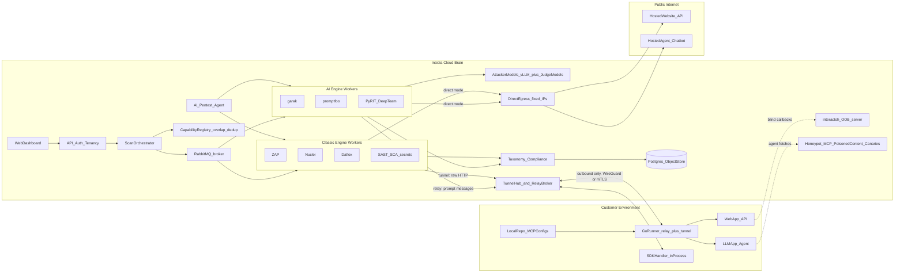

# Insidia AI Security Platform - Master Plan (v5: multi-tenant cloud brain, direct or runner connection)

Plans are stored in both `/home/rushi/Desktop/Rushi/Insidia-Labs/plans/` and this repo's `plans/`. This file is `00-master-plan.md`. The AI attack coverage requirements live in `01-ai-redteam-coverage-spec.md`.

## Phase plans
- [02-phase0-foundations.md](02-phase0-foundations.md)
- [17-test-suite.md](17-test-suite.md) (Phase T: test harness first, cross-cutting gate)
- [03-phase1-vertical-slices.md](03-phase1-vertical-slices.md) (tracks 1A and 1B)
- [04-phase2-dashboard.md](04-phase2-dashboard.md)
- [05-phase3-taxonomy-compliance.md](05-phase3-taxonomy-compliance.md)
- [06-phase4-depth.md](06-phase4-depth.md) (tracks 4A and 4B)
- [07-phase5-pentest-agent.md](07-phase5-pentest-agent.md)
- [08-phase6-engine-registry.md](08-phase6-engine-registry.md)
- [09-phase7-agent-security.md](09-phase7-agent-security.md)
- [10-phase8-whitebox.md](10-phase8-whitebox.md)
- [11-phase9-continuous.md](11-phase9-continuous.md)
- [12-phase10-enterprise.md](12-phase10-enterprise.md)
- [13-phase11-later.md](13-phase11-later.md)
- [14-database-schema.md](14-database-schema.md) (security-first database design, cross-cutting)
- [15-customer-docs.md](15-customer-docs.md) (customer documentation, cross-cutting)
- [16-coverage-gaps.md](16-coverage-gaps.md) (internal: engine coverage gaps and the Insidia modules that fill them)
- [17-test-suite.md](17-test-suite.md) (Phase T: test-first permutation suite, cross-cutting gate)

## Scope
Insidia is an **AI-native application security platform**. It covers two tracks, built in parallel:
- **AI/agent security:** prompt injection, jailbreaks, agent tool misuse, RAG and memory poisoning, supply chain, unbounded consumption, multi-agent abuse. Full requirements in `01-ai-redteam-coverage-spec.md`.
- **Classic AppSec:** web DAST (SQLi, XSS, SSRF), API security (BOLA/IDOR, auth), SAST, secrets, dependency/SCA, and infra/CVE scanning.

The differentiator is the seam between them: an AI pentest agent that chains an AI attack into a classic exploit, for example a prompt injection that makes an agent call a tool with a SQL injection payload that a plain DAST scanner would never reach. Competitors sit on one side only: Mindgard, Lakera, HiddenLayer (AI) vs Burp Enterprise, Snyk API & Web, Invicti (classic). XBOW and Strix are the closest on the AI-pentest-agent side.

## Key decisions
- **Architecture:** a multi-tenant cloud brain plus an optional thin runner, the model Mindgard and Lakera Red use. All attack generation, engines, judging, and mapping run in our cloud. IP stays server-side.
- **Two ways to connect a target** (see "Connection modes" below):
  - **Direct (no runner):** the target is publicly reachable (hosted website, public API, hosted agent). The user sets it up entirely from the dashboard and the brain calls it from our egress IPs after ownership verification.
  - **Runner (local setup):** the target is internal, on localhost, or needs local-only features. The customer installs the Go runner, which relays prompts (relay mode) or tunnels raw HTTP (tunnel mode, outbound WireGuard, the model Snyk API & Web's Farcaster uses). Recommended for full coverage.
- **Runner language:** Go. Single static binary, small footprint, harder to reverse-engineer.
- **Cloud brain language:** Python 3.14. Engines that don't yet support 3.14 run isolated in their own containers on their own Python, so the control plane can move ahead.
- **Multi-tenant, one brain, many runners.** A single shared cloud brain serves all customers. Each customer has many runners; the brain scans them all. Tenant isolation, fair scheduling, and per-tenant quotas are built in from Phase 1, not retrofitted.
- **Orchestration:** Celery with **RabbitMQ** as the broker. Valkey (BSD-3, Redis-compatible) for fairness leases, cache, and progress pub/sub. Not Redis 8+: it is licensed AGPLv3/SSPLv1/RSALv2, which fails our license gate for on-prem. RabbitMQ is MPL-2.0 and **requires attribution**; see "Attribution register".
- **Database is security-critical.** We store customers' actual, often unfixed vulnerabilities. Schema, encryption, and access rules are specified in [14-database-schema.md](14-database-schema.md) and treated as a Phase 0/1 deliverable, not an afterthought.
  - **No customer value is stored in plaintext.** Names, URLs, hosts, emails, IPs, evidence, and audit metadata are encrypted with per-org keys held in KMS. Only Insidia-generated ids, enums, timestamps, and hashes are plaintext, enforced by a schema CI test.
  - **Customer secrets are kept by the customer where possible** (runner, or their cloud secret manager), otherwise stored write-only and shown only as a fingerprint. Secrets found in scan evidence are redacted to a masked token before storage. Tokens we issue are stored only as HMACs.
- **Gaps are filled with Insidia-built modules.** The OSS engines do not cover everything, especially with promptfoo's remote generation off and GPL tools excluded. [16-coverage-gaps.md](16-coverage-gaps.md) lists every gap and the module or permissively licensed tool that fills it. Modules register like engines and appear as Insidia Engine modules.
- **Test-first.** Every valid permutation of connector, box mode (black/gray/white), attack type, and connection mode has a sandboxed ground-truth test with a pass threshold **before** the feature is built. OSS vulnerable apps (Juice Shop, crAPI, VAmPI, DVGA, AgentDojo) and our own fixtures run local-only with no internet egress. This is Phase T ([17-test-suite.md](17-test-suite.md)) and a hard exit-gate on every later phase; it is the single source of truth the Phase 6 benchmark reuses.
- **Dashboard design follows the apple-design skill** (`.agents/skills/apple-design/`), translated into concrete rules in [04-phase2-dashboard.md](04-phase2-dashboard.md#design-system-apple-design-skill).
- **Customer documentation is part of every phase's exit.** Docs-as-code in `docs/`, generated references, samples tested in CI, no engine names. See [15-customer-docs.md](15-customer-docs.md).
- **No free/local/BYOK mode.** We pay for and operate the attacker and judge models.
- **Closed source, MIT/Apache OSS only** (plus MPL-2.0/BSD infrastructure after review). We use the OSS engines as they are. **No porting.** Instead, the dashboard and website never name them: every engine appears as the **Insidia Engine**. See "Confidentiality of the stack".
- **Engine overlap is a product setting.** Several engines cover the same attack family (for example garak and promptfoo both do jailbreaks). A capability registry maps each attack family to the engines that cover it, and the user picks per scan whether to run one engine or all of them. See "Engine overlap and selection".
- **Desktop app deferred.** The web dashboard is the primary UI.
- **Enterprise data concerns** handled with regional instances, private single-tenant deployments, and an on-prem deployment of the cloud brain, so the brain is containerized from day one.

## Architecture



This diagram is **internal**. The customer-facing version (dashboard "how it works" view, website) collapses every engine box into a single **Insidia Engine** node. See "Confidentiality of the stack".

### Scan flow
1. A user creates a scan: target, connection mode (direct or runner), test mode (black/gray/white box), profile (e.g. "OWASP LLM Top 10 2026"), and engine coverage (single or all overlapping engines).
2. The orchestrator asks the capability registry which engines cover each attack family in the profile, applies the coverage choice, and enqueues Celery tasks on RabbitMQ.
3. **Direct mode:** workers call the public target from our fixed egress IPs through an egress proxy that enforces the verified host list, rate limits, and a per-scan kill switch.
4. **Runner mode, AI:** workers use a RelayTarget plugin that sends `{scan_id, attempt_id, session_id, conversation}` to the hub, which forwards to the runner.
5. **Runner mode, classic:** workers send raw HTTP through the hub into the runner's WireGuard tunnel, reaching only allowlisted hosts.
6. Detectors, oracles, and the judge score results. The normalizer produces `Finding`s, deduplicates across overlapping engines, tags them with taxonomy ids, encrypts sensitive fields, and stores them.

## Connection modes: direct (dashboard only) vs runner (local setup)
Both flows are first-class. The target record says which one it uses.

**Direct mode (no install).** For hosted websites, public APIs, and hosted agents or chatbots.
- The user adds the target URL in the dashboard. Nothing is installed.
- **Ownership verification is mandatory before any active test:** DNS TXT record, a file at `/.well-known/insidia-verify.txt`, or an HTML meta tag. Verification is re-checked before each scan and expires (for example every 30 days). Unverified targets can only run passive, non-intrusive checks, or nothing.
- Traffic leaves from a small set of published, fixed egress IPs so customers can allowlist them in a WAF. The egress proxy is the direct-mode equivalent of the runner allowlist: it refuses any host that is not a verified target of that org, and blocks private and link-local ranges (10/8, 172.16/12, 192.168/16, 169.254/16, IPv6 ULA) so a public target cannot redirect us into our own cloud network (SSRF against the brain).
- Target credentials, in order of preference: a reference to the customer's cloud secret manager (read at scan time, never stored by us), an OAuth client that mints short-lived tokens per scan, or a stored write-only value encrypted with the org's secrets key. The dashboard never shows a stored secret back, only its fingerprint, and only the egress proxy decrypts it. See [14-database-schema.md](14-database-schema.md#customer-secrets). The dashboard recommends dedicated test accounts, never production admin credentials.
- Hosted-agent tests use the same relay protocol, but the "runner" is a cloud-side direct transport inside the egress proxy. Engines cannot tell the difference, so no engine code forks.

**Runner mode (local setup, recommended for full coverage).** For localhost, staging behind a VPN, internal networks, and anything that needs the customer's machine.
- The customer installs the Go runner and enrolls it from the dashboard.
- Credentials stay on the runner (`secret_ref`), never in our cloud.
- Ownership is implied by the customer installing the runner inside their network, plus the per-runner host allowlist.

**Feature availability**

| Capability | Direct | Runner |
| --- | --- | --- |
| AI chat, RAG, and hosted-agent attacks via a public endpoint | Yes | Yes |
| Web DAST and API scans of public hosts | Yes | Yes |
| Localhost, private network, and VPN-only targets | No | Yes |
| Credentials that never leave the customer network | No | Yes |
| Runner-side redaction before data reaches us | No | Yes |
| White-box `extract` of a local repo | No (upload only) | Yes |
| MCP/skill `discover` on developer machines | No | Yes |
| In-process SDK handler for non-HTTP agents | No | Yes |
| CI one-shot `scan` | API-driven only | Yes |

The dashboard shows this table when a user picks a connection mode, and marks runner-only profile items as unavailable for direct targets rather than silently skipping them.

## Engine overlap and selection
Several engines cover the same attack family. Examples: jailbreaks (garak, promptfoo, PyRIT, DeepTeam), prompt injection (garak, promptfoo, DeepTeam), XSS (ZAP, Dalfox, Nuclei), known CVEs (Nuclei, ZAP).

**Capability registry** (`engine/workers/common/registry.py`, data in the database; see schema): each row maps `attack_family -> engine -> probe set`, with a default priority, expected cost, and median runtime. It is internal and holds real engine names.

**Customer choice, per scan and per profile**, shown in the dashboard without engine names:
- **Standard (default):** one engine per attack family, the highest-priority one. Cheapest and fastest.
- **Thorough:** every engine that covers the family runs. Findings are merged and marked "cross-validated" when two or more engine modules confirm them, which raises confidence.
- **Custom (advanced):** per attack family, a toggle between Standard and Thorough.

The dashboard labels engines as numbered Insidia Engine modules only where a distinction is unavoidable (for example "Jailbreak coverage: 3 modules available"). Estimated time and cost update live as the user toggles, because Thorough can multiply runtime and model spend.

**Deduplication across engines:** the normalizer maps each engine's result to an Insidia probe id and attack family, then merges findings with the same `(org, target, attack_family, normalized_evidence_hash)`. The merged finding keeps every contributing result internally for audit.

**Staff-only view:** an internal admin console, never reachable by customer accounts, shows real engine names and per-engine stats for tuning priorities.

### How OSS engines plug in (no forks)
- **garak:** custom generator (`insidia.RelayGenerator`); raise `parallel_requests` to hide relay latency.
- **promptfoo:** custom provider (`file://relay_provider`) implementing `callApi`; attacker and grader point at our model service; `PROMPTFOO_DISABLE_REMOTE_GENERATION=true`, `PROMPTFOO_DISABLE_TELEMETRY=1`, `PROMPTFOO_DISABLE_SHARING=1`.
- **PyRIT:** `PromptChatTarget` subclass; multi-turn orchestrators (Crescendo, TAP, PAIR) unchanged.
- **DeepTeam:** async `model_callback` awaiting the relay.
- **ZAP:** run headless with its API; configure its proxy to egress through the tunnel; parse alerts.
- **Nuclei / Dalfox:** run as CLIs pointed at the tunneled target; parse JSON output; templates updated centrally.
- **Static scanners (mcp-scanner, SkillSpector, Trivy, osv-scanner, gitleaks):** the runner collects artifacts and uploads them redacted; the cloud scans.

## Core contracts (Phase 1, versioned)

Relay protocol (protobuf over gRPC/WSS):
```protobuf
message AttemptRequest { string scan_id = 1; string attempt_id = 2; string session_id = 3;
  repeated Turn conversation = 4; map<string,string> vars = 5; int32 timeout_ms = 6; }
message AttemptResponse { string attempt_id = 1; string output = 2; int32 status = 3;
  int64 latency_ms = 4; bytes raw_ref = 5; string error = 6; bool redacted = 7; }
message RunnerHello { string runner_id = 1; string version = 2; repeated string target_ids = 3;
  repeated string allowlist_hosts = 4; repeated Mode modes = 5; }  // Mode: RELAY, TUNNEL
```

Target config (stored in cloud; in runner mode credentials resolve only on the runner, in direct mode they are envelope-encrypted in our vault):
```yaml
target: support-bot-staging
connection: runner     # or direct (hosted target, no install; requires ownership verification)
runner: runner-blr-01  # omitted in direct mode
mode: relay            # or tunnel for web/API targets
transport: http
request_template: '{"messages": {{conversation_json}}, "user": "insidia"}'
response_selector: "$.choices[0].message.content"
auth: { header: "Authorization", secret_ref: "env:SUPPORT_BOT_TOKEN" }
session: { mode: cookie | header | body_field, key: conversation_id }
rate_limit: { rps: 5, concurrency: 8 }
```

Findings schema: `Finding{track, engine, probe, severity, confidence, attack, response, trace_ref, taxonomy[], remediation, evidence_hash}`. The `engine` field is **internal only** and is never exposed in the UI, reports, or API; external `probe` names use our own naming, not the upstream engine's. Taxonomy prefixes: `owasp-llm:LLM01`, `owasp-asi:ASI02`, `owasp-web:A03`, `owasp-api:API1`, `atlas:AML.T0051`, `attack:T1190`, `cwe:CWE-89`, `cvss:9.8`, `nist-rmf:MS-2.7`, `eu-ai-act:art15`, `pci:6.4`.

## Go runner design
- **Modes:** relay (AI, one prompt at a time) and tunnel (userspace WireGuard for raw HTTP).
- **Commands:** `enroll`, `run` (daemon), `scan` (one-shot CI), `validate`, `discover`, `extract`.
- **Enrollment:** one-time token exchanged for a per-runner mTLS cert; auto-reconnect with backoff; heartbeat.
- **Transports (relay):** HTTP/REST, WebSocket, OpenAI-compatible, Anthropic, Bedrock, Azure OpenAI, raw Burp-style template.
- **Tunnel:** userspace WireGuard (no root), host allowlist enforced runner-side so the cloud reaches only approved targets.
- **Secrets** resolved only on the runner (env, file, Vault); never sent to cloud.
- **Safety:** per-runner host allowlist, global rate limits, cloud kill switch, local audit log, target ownership verification.
- **Redaction:** customer-configurable regex/entity rules applied before responses leave the runner.
- **Extract (white box):** tree-sitter parse of the local repo; uploads only artifacts (prompts, tool schemas, agent graphs, dependency manifests, MCP/skill configs).
- **Distribution:** cosign-signed binaries, Docker image, Helm chart, Homebrew/apt/winget.

## Cloud brain design
- **Control plane:** Python 3.14 FastAPI modular monolith. Modules: tenancy, targets, scans, findings, taxonomy, compliance, reports, runners, agent, billing.
- **Orchestration (Celery):** the API enqueues Celery tasks; workers pull from queues and shell out to the engine subprocesses. A scan is a Celery canvas: a `chord` of per-probe/per-batch `group` tasks with a finalizer that aggregates and scores. Chunk work into many small tasks (per probe or per attempt batch) for retry, progress, and fairness rather than one long task per scan.
  - **Broker:** RabbitMQ (MPL-2.0, attribution required). Durable queues, publisher confirms, `acks_late=True` and `reject_on_worker_lost=True` so a crashed worker does not lose a task. One vhost per environment; tenant separation is in the task envelope, not per-tenant vhosts.
  - **Result backend:** Postgres (our own tables), not the broker. Task results can contain vulnerability data, so they live under the same RLS and encryption as findings. Celery results expire quickly; the durable record is the `scan_tasks` row.
  - **Valkey (BSD-3):** fairness leases, rate-limit buckets, cache, and progress pub/sub. No vulnerability payloads are stored in Valkey, only ids and counters.
  - **Queues by engine type and priority:** e.g. `ai.fast`, `ai.heavy` (garak/PyRIT), `classic.dast` (ZAP/Nuclei), `static`, `agent`, `reports`. Dedicated worker pools per queue, autoscaled on queue depth.
  - **Engine execution:** one container image per engine (garak, a Node image for promptfoo, PyRIT/DeepTeam, ZAP, Nuclei/Dalfox, SAST/SCA), each on its own Python where needed. Celery workers run inside these images.
- **Tunnel hub + relay broker:** Go service holding runner connections; routes by runner/target; backpressure, timeouts, retries; WireGuard termination. Celery tasks reach targets only through the hub.
- **Models:** attacker models self-hosted on vLLM (commercial APIs refuse attack generation); judge models mixed commercial/self-hosted; per-scan cost tracking.
- **OOB server:** hosted interactsh for blind SQLi/SSRF/RCE callback confirmation.
- **Direct egress proxy:** cloud-side service with fixed public IPs; enforces verified hosts per org, blocks private/link-local ranges, applies rate limits and the kill switch. Also acts as the direct-mode relay transport.
- **Storage:** Postgres for metadata/findings, with field-level envelope encryption for vulnerability evidence; S3-compatible object store for transcripts/evidence, encrypted per tenant. Full design in [14-database-schema.md](14-database-schema.md).
- **Web:** React (Vite) + TypeScript + Tailwind + shadcn/ui; live progress over WebSocket (fed by worker progress events on Valkey pub/sub, ids only).
- **Deployment:** Kubernetes + Helm; Terraform for our cloud; same charts for private tenants and on-prem.

## Multi-tenancy and fair scheduling (one brain, many customers)
- **Identity:** every row, task, object-storage key, and log line carries `org_id` (and `project_id`). Postgres row-level security enforces isolation; object storage is prefixed and encrypted per tenant.
- **Task envelope:** every Celery task carries `{org_id, project_id, scan_id}`. A middleware sets the tenant context and the DB session role from it.
- **Fairness (Celery has no built-in fair scheduling):** one noisy customer must not starve others. Approach:
  - Per-org concurrency caps and token-bucket rate limits enforced at dispatch (a Valkey-backed gate before a task is allowed to run).
  - RabbitMQ queue priorities (`x-max-priority`) so interactive scans outrank scheduled bulk scans.
  - A dispatcher that round-robins across orgs with queued work rather than draining one org's tasks first.
  - Per-org and per-scan budgets (max attempts, max tokens, max wall-clock); exceeding a budget pauses the scan, not the worker.
- **Isolation of blast radius:** target host allowlists are per-runner and per-org; the tunnel hub refuses cross-org routing; the direct egress proxy only reaches verified hosts of the scan's org; interactsh callbacks are keyed per scan.
- **Quotas and metering:** attempts, model tokens, and tunnel bytes are metered per org for billing and for enforcing plan limits.
- **Noisy-neighbor safety:** large enterprises can later be pinned to dedicated worker pools or a private tenant (Phase 10) without code change, because the tenant context already exists.

## Monorepo layout
Three distinct top-level components: `runner/` (Go, on the customer side), `engine/` (the cloud brain), and `dashboard/` (the web UI). Shared and ops files sit alongside.
```
Insidia-Labs/
  runner/                 Go thin runner (relay + tunnel); the only distributed component
  engine/                 the cloud brain
    api/                  FastAPI control plane (Python 3.14): tenancy, targets, scans, findings, taxonomy, compliance, reports, runners, billing
    workers/              Celery workers
      ai/                 garak, promptfoo, pyrit, deepteam (used as-is, not ported)
      classic/            zap, nuclei, dalfox, sast, sca
      static/             mcp/skill/model/deps scanners
      insidia/            Insidia-built gap-filling modules (M-A*, M-C*; see 16-coverage-gaps.md)
      common/             task envelope, tenant context, fairness/dispatch, capability registry, dedup, progress events
    api/crypto/           key service client, envelope encryption, blind indexes, secret redactor
    egress/               direct-mode egress proxy (fixed IPs, verified-host enforcement)
    agent/                AI pentest agent (Strix-based orchestrator)
    hub/                  Go tunnel hub + relay broker
    models/               vLLM configs, judge prompts (proprietary)
    taxonomy-data/        YAML framework mappings
  dashboard/              React (Vite) web app
  shared/
    proto/                relay + control protocol (used by runner, hub, engine)
    sdk/python, sdk/js    in-process handler + OTel instrumentation
  deploy/                 helm/, terraform/, docker-compose (dev)
  tests/                  Phase T: permutation matrix, sandboxed targets, ground truth, harness (see 17-test-suite.md)
  docs/                   customer documentation site (Starlight); never names engines
  internal/               ADRs, threat model, security policies (not published)
  schema/                 plaintext allowlist and schema CI rules
  .agents/skills/         apple-design skill used for all dashboard work
  THIRD_PARTY_NOTICES.md  internal source of truth for OSS and attribution (see "Attribution register")
```
Note: `engine/hub/` is Go while the rest of `engine/` is Python; it is grouped under the brain because it is server-side infrastructure, not a customer artifact.

## Framework and compliance coverage
- **AI:** OWASP LLM Top 10 2026 (LLM01-LLM10), OWASP Agentic Top 10 2026 (ASI01-ASI10), MITRE ATLAS (v2026.06), OWASP AIVSS scoring, OWASP DSGAI.
- **Classic:** OWASP Top 10 (web), OWASP API Security Top 10, CWE 4.20, CVSS, MITRE ATT&CK v19.1.
- **Governance:** NIST AI RMF, NIST AI 600-1, EU AI Act (Art. 9, 10, 15), ISO/IEC 42001, CSA AICM, SOC 2 / ISO 27001, PCI DSS (6.4, 11.3).
- **Outputs:** executive PDF, technical HTML, control-coverage matrix, evidence pack (transcripts + hashes), SARIF, JSON, CycloneDX AI-BOM.
- OWASP content is CC BY-SA; we reference IDs/titles and write our own descriptions.

## OSS reuse (MIT/Apache only)
- **AI engines (used as-is, wrapped via their plugin interfaces, not ported):** garak (Apache), promptfoo (MIT), PyRIT (MIT), DeepTeam (Apache), Cisco mcp-scanner (Apache), NVIDIA SkillSpector (Apache), ModelScan (Apache).
- **Infrastructure:** RabbitMQ (MPL-2.0, attribution required), Valkey (BSD-3), PostgreSQL (PostgreSQL License), Celery (BSD-3), WireGuard-go (MIT).
- **Classic engines:** ZAP (Apache), Nuclei + templates (MIT), Dalfox (MIT), katana/httpx/subfinder/ffuf (MIT), interactsh (MIT), Trivy (Apache), osv-scanner (Apache), gitleaks (MIT), Bandit (Apache), gosec (Apache).
- **Adopted to fill gaps** (see [16-coverage-gaps.md](16-coverage-gaps.md)): naabu (MIT, ports), tlsx (MIT, TLS), Adversarial Robustness Toolbox and TextAttack (MIT, predictive ML), OpenSSF model-signing (Apache, model provenance), Playwright (Apache, login recorder and sink rendering). opengrep (LGPL-2.1) is pending legal review for SAST.
- **Docs and UI:** Starlight and Pagefind (MIT) for the docs site; Motion (MIT) for dashboard animation.
- **AI pentest agent:** `usestrix/strix` (Apache 2.0) - adapted as the orchestrator that drives both tracks and validates exploits (the one place we modify upstream code, because its tools must call our hub). PentAGI (MIT code, EULA) as reference only.
- **Reference / rules:** splx Agentic Radar (Apache), AgentDojo (MIT), Inspect AI (MIT), Pipelock (Apache), LLM Guard (MIT), NeMo Guardrails (Apache). (Tencent AI-Infra-Guard is excluded from the shipped stack; see below.)
- **Runner transport reference:** Praetorian Augustus (Apache, Go); Probely Farcaster agent (for the WireGuard tunnel design).
- **Avoid:** GPL/copyleft (sqlmap GPLv2, Nikto, Wapiti, commix; nmap NPSL) for on-prem distribution; Redis 8+ (AGPLv3/SSPLv1/RSALv2; use Valkey); Semgrep registry rules (competing-SaaS restriction); CAI (commercial license); `Strixgov/strix` (Elastic license, different project); Snyk agent-scan (proprietary service).
- **Excluded because it forces public attribution:** Tencent AI-Infra-Guard's code/engine requires an "About" page credit, which conflicts with keeping the stack confidential. We do **not** ship its code. We may still read its public rules as research and reimplement equivalents independently.
- **Adapter rules:** use upstream packages unmodified where possible; keep their LICENSE/NOTICE files in our source tree and images; pin versions; add a contract test per adapter. If we ever patch an upstream file, mark it modified (Apache 2.0 section 4b) and keep the patch in our repo.
- **Exception, the pentest agent:** Phase 5 adapts code from `usestrix/strix` because its tool surface must call our hub instead. Those files keep their Apache headers and are marked modified.

## Attribution register
Some dependencies require attribution or notices. We honor all of them in a place that is legally sufficient but not marketing: the internal `THIRD_PARTY_NOTICES.md`, a licenses file shipped inside every distributed artifact (runner binary, on-prem images), and a plain "Open-source licenses" page linked from the dashboard footer or legal page if counsel says one is needed. This page lists licenses, not what each component does in our pipeline.

| Component | License | What we must do |
| --- | --- | --- |
| RabbitMQ | MPL-2.0 | Keep its license and notices; if we modify any MPL file, publish that file's source. Use unmodified. Include the notice in on-prem images. |
| Apache-2.0 deps (garak, DeepTeam, ZAP, Trivy, osv-scanner, mcp-scanner, SkillSpector, ModelScan, Strix) | Apache-2.0 | Keep LICENSE and NOTICE files; mark modified files; include NOTICE in distributed artifacts. |
| MIT/BSD deps (promptfoo, PyRIT, Nuclei, Dalfox, interactsh, gitleaks, Valkey, Celery) | MIT / BSD | Keep copyright and license text in distributed artifacts. |
| OWASP content | CC BY-SA 4.0 | Cite OWASP when we reference their ids; write our own descriptions so share-alike does not attach to our text. |
| MITRE ATLAS / ATT&CK | Apache-2.0 / MITRE terms | Cite MITRE; keep license text with the imported data. |

The CI license gate (Phase 0) fails the build when a new dependency's license is not in this table or the allowlist.

## Confidentiality of the stack
We do not want to disclose that garak, promptfoo, ZAP, Nuclei, Strix, etc. run in our backend. We use them as-is; we do **not** port them. Confidentiality comes from presentation, not rewriting. This is legally workable, but only under these conditions:
- **Everything customer-facing says "Insidia Engine".** Dashboard, website, reports, SARIF `tool.driver.name`, API responses, emails, and webhooks. Any diagram of how scanning works (dashboard "how it works" view, website architecture graphic, sales decks) shows a single **Insidia Engine** box between the customer's target and the findings. Where modules must be distinguished (engine overlap selection), they are "Insidia Engine modules", numbered or named by capability ("Jailbreak module"), never by upstream project.
- **A masking layer, not a port.** The normalizer maps upstream probe names to Insidia probe ids, and the API response models omit the internal `engine` field. A CI denylist test fails if any upstream product name appears in API samples, rendered reports, SARIF, or dashboard builds.
- **SaaS use is not "distribution".** MIT and Apache 2.0 attach their notice obligations to *distributing copies* of the software. Running these tools server-side in our cloud is not distribution, so no public disclosure is required. We still keep the LICENSE/NOTICE files in our private source tree.
- **Apache 2.0 patent/NOTICE terms** only require propagating NOTICE content when we distribute. Cloud-only engines never trigger this.
- **The runner is distributed**, so anything we bundle into the Go runner must carry notices. Keep the runner free of recognizable OSS by doing scanning in the cloud, not in the runner. The runner stays a thin relay/tunnel.
- **On-prem (Phase 10) is distribution.** An air-gapped enterprise install ships our container images to the customer. Included MIT/Apache components must then carry a `THIRD_PARTY_NOTICES.md` inside the image. This is a bundled licenses file, not marketing, and it can be argued as required only for the components actually shipped. Legal review before the first on-prem deal.
- **Drop attribution-required deps:** AI-Infra-Guard (above). Verify no other dep adds an attribution or "powered by" clause.
- **Traffic fingerprints:** the egress proxy and the tunnel hub rewrite User-Agent and scanner headers to `InsidiaScanner` so the target's logs do not name the tools. Payloads themselves may still resemble public attack corpora; that is acceptable and not something we try to hide.
- **Honest limit:** a determined researcher can sometimes infer a tool from payload patterns. The goal is no disclosure by us, not guaranteed undetectability.
- This is a business/marketing stance, not a way to remove license obligations. The attribution register above is honored in full.

## Phases (AI track = A, classic track = B, run in parallel)

Every build phase (1 onward) has an implicit exit gate on top of the criteria listed: the permutation-matrix cells it owns ([17-test-suite.md](17-test-suite.md)) must be green. The per-phase ownership map lives in that file.

### Phase 0 - Foundations
Monorepo scaffold with the three top-level components (`runner/` Go, `engine/` Python 3.14 + `engine/hub/` Go, `dashboard/` React), ADRs (direct vs runner connection, relay + tunnel protocols, Celery on RabbitMQ, Valkey not Redis, multi-tenancy model, use-as-is plus masking, license policy and attribution register, database security), the security-first database foundation from [14-database-schema.md](14-database-schema.md) (roles, RLS, envelope encryption, audit), self threat model (runner compromise, tunnel abuse, direct-mode SSRF, tenant isolation, cross-org leakage, database breach, target ownership verification), CI, dev docker-compose (Postgres + RabbitMQ + Valkey + a worker). Exit: services build, CI green, a demo Celery task runs with a tenant envelope and writes an encrypted row another org cannot read.

### Phase T - Test harness first
Right after the Phase 0 scaffold and before building scanners: the permutation matrix (connector x box mode x attack type x connection mode, with a validity function marking impossible cells N/A), the sandboxed local-only targets (Juice Shop, crAPI, VAmPI, DVGA, AgentDojo, plus our own chatbot/RAG/agent/A2A/API/code fixtures, all on an internal network with no egress), ground-truth manifests with per-cell recall/precision thresholds, and the pytest harness. Every valid cell has a test written red (xfail). Full spec in [17-test-suite.md](17-test-suite.md). This is the single source of truth the Phase 6 benchmark reuses, and it gates every later phase: a phase exits only when the matrix cells it owns are green. Exit: the harness runs, the matrix is provably complete (valid + N/A = full cross-product), the egress-deny guard passes, and all cells are present as xfail.

### Phase 1 - Vertical slices for both tracks
- **1A (AI):** relay protocol, Go runner relay mode, hub relay broker, control plane (tenancy/targets/scans) with Celery orchestration and the tenant task envelope, garak + promptfoo workers with RelayTarget, findings normalizer. Exit: a runner scans a localhost chatbot, findings via API, with `org_id` isolation enforced.
- **1B (Classic):** runner tunnel mode (userspace WireGuard), hub tunnel termination, ZAP + Nuclei + Dalfox Celery workers, hosted interactsh. Exit: a runner tunnels to a localhost web app, DAST findings via API.
- **1C (Direct mode):** ownership verification (DNS TXT, well-known file, meta tag), the direct egress proxy with fixed IPs and private-range blocking, encrypted target credentials, and the direct relay transport. Exit: a verified public fixture is scanned for AI and web findings with no runner installed; an unverified host and a redirect to `169.254.169.254` are both refused.
- **Capability registry v1:** attack family to engine mapping with Standard (one engine) and Thorough (all engines) coverage, plus cross-engine dedup in the normalizer.
- **Fairness baseline:** per-org concurrency caps and the round-robin dispatcher land here so multi-tenant behavior is correct from the first scan.

### Phase 2 - Web dashboard and tenancy
Org/project/user model, login, API keys; target wizard that starts with **"How do we reach your target?"** (Direct: hosted, no install; or Runner: local setup, recommended) and shows the feature availability table; ownership verification flow for direct targets; runner enrollment/health; scan launcher with **engine coverage** (Standard, Thorough, Custom per attack family, with live time and cost estimate, engines shown only as Insidia Engine modules); live progress; unified AI + classic findings triage with a "cross-validated" badge; transcript/request viewer; usage metering; "how it works" view that shows a single Insidia Engine. Exit: a customer signs up and runs scans both ways: a direct scan of a hosted target, and a runner scan of a localhost target.

### Phase 3 - Unified taxonomy and compliance
`taxonomy-data/` covering all frameworks above (seed from promptfoo MIT mappings and the LLM Top 10 2026 machine-readable mappings); framework-based profiles; control-coverage engine; reports (PDF/HTML), evidence packs, SARIF/JSON, ATLAS heatmap. Exit: one run produces OWASP LLM, OWASP Web, and EU AI Act reports.

### Phase 4 - Depth on both tracks
- **4A (AI depth):** PyRIT/DeepTeam multi-turn; indirect-injection, RAG, and memory harnesses (surfaces B/D from the coverage spec); the oracle framework (canary, tool-trace, goal-diff, groundedness, resource, ACL, manifest-drift); self-hosted attacker models on vLLM; judge calibration.
- **4B (Classic depth):** API scanning (REST/GraphQL, BOLA/IDOR, auth/session, mass assignment); SAST + secrets + SCA (Trivy, osv-scanner, gitleaks, tree-sitter rules); infra/CVE (Nuclei network templates). Exit: gray-box AI and authenticated web/API scans beat black-box baselines.
- **Gap modules:** most Insidia-built modules land here: M-A1, M-A2, M-A3, M-A5, M-A6, M-A10, M-A11, M-A14 (AI) and M-C1, M-C2, M-C3, M-C4, M-C7, M-C9 (classic). See [16-coverage-gaps.md](16-coverage-gaps.md).

### Phase 5 - AI pentest agent (the differentiator)
Adapt `usestrix/strix` into `engine/agent/`: an LLM-driven orchestrator with access to both relay and tunnel tools, a browser, and the OOB server. It plans chained attacks (prompt injection -> tool call -> SQLi/SSRF in the backend), validates with proof-of-concept, and emits findings with repro steps. Exit: the agent demonstrates one AI-to-classic chained exploit on a benchmark app.

### Phase 6 - Engine registry, overlap tuning, and Insidia Engine presentation
No porting. The engines stay as they are. This phase matures what Phase 1 started: the capability registry grows to every engine and attack family; per-engine precision and cost are measured on the benchmark suite and used to set Standard-mode priorities; cross-engine dedup and the "cross-validated" confidence boost are tuned; the masking layer is hardened (denylist CI over API, reports, SARIF, dashboard bundle, emails, webhooks); the staff-only engine console ships; optional Insidia-authored attack packs fill gaps no engine covers. Exit: every attack family in the default profiles has a measured Standard engine, Thorough mode finds strictly more confirmed issues on the suite, and the denylist test is green across every customer-facing surface.

### Phase 7 - Agent security
Runner `discover` (MCP configs, skills, A2A cards, frameworks); MCP/skill static scans (mcp-scanner, SkillSpector; independently reimplemented rules inspired by public research) + tool-hash pinning for rug-pull; cloud-hosted honeypot MCP, poisoned web/docs/email, canary tokens; harnesses for LangGraph, CrewAI, OpenAI Agents SDK, AutoGen, raw MCP, and multi-agent/A2A; trace-based policy judge; ASI01-ASI10 suites; attack-path graph. Exit: agent scan reports ASI-mapped findings with tool-call evidence.

### Phase 8 - White box
Runner `extract` (tree-sitter extraction; secrets reported as findings, values never uploaded); cloud analysis (injection sinks, unsafe output handling, over-privileged tools), osv-scanner, ModelScan, CycloneDX AI-BOM; SDK handler (in-process, Lakera-style) + OTel GenAI traces through the runner; white-box context feeds the Phase 4A/5 planners. Exit: pointing at a repo yields static findings + auto-generated targeted dynamic tests.

### Phase 9 - Continuous and developer workflow
One-shot runner `scan` for CI; GitHub Action, GitLab template; baselines, regression diffs, severity-threshold gating; scheduled/continuous scans, alerts, Jira/Slack/SIEM; Burp extension as a runner; fleet (MDM) discovery. Exit: continuous scanning for a pilot customer.

### Phase 10 - Enterprise
SSO (SAML/OIDC), RBAC, audit log, retention controls; regional instances, private single-tenant, on-prem Helm deployment of the full brain (air-gapped, local vLLM); SOC 2 readiness. Exit: first private/on-prem enterprise deployment.

### Phase 11 - Later
Desktop app (runner GUI: tray app with enrollment, status, local audit view) + dashboard link; runtime guardrails/firewall reusing detectors as inline policies.

## Key risks
- **Relay latency/throughput:** batch attempts, raise concurrency, sticky sessions.
- **Tunnel security:** userspace WireGuard, strict host allowlist, no inbound ports, per-tenant isolation.
- **Upstream engine changes:** pin versions, contract tests per adapter, and the capability registry can drop a broken engine to another covering engine without a code change.
- **Database breach:** we hold customers' unfixed vulnerabilities, which makes us a high-value target. Envelope encryption per org, no evidence in logs or the broker, least-privilege DB roles, and retention limits (see [14-database-schema.md](14-database-schema.md)).
- **Direct mode abuse:** scanning hosts the customer does not own, or SSRF into our cloud. Mandatory, expiring ownership verification and a private-range-blocking egress proxy.
- **Thorough-mode cost:** running every overlapping engine multiplies model spend. Show the estimate before launch and count it against the org's budget.
- **Model costs:** self-hosted attacker models, caching, per-scan budgets.
- **Customer trust in cloud data:** runner-side redaction, regional/private tenants, on-prem.
- **Coverage claims outrunning reality:** the engines leave real gaps (see [16-coverage-gaps.md](16-coverage-gaps.md)). Customer-facing coverage pages are generated from the registry and benchmark, not written by hand.
- **Engines phoning home:** some OSS tools send telemetry or call their vendor's API. Engine containers get no internet egress except the target path and our model service, verified in CI.
- **Legal/misuse:** target ownership verification, allowlists, ToS, safety-content gating; GPL tools kept out of on-prem distribution.
- **Scope creep:** two tracks in parallel need staffing; if constrained, lead with the AI track and the Phase 5 agent.
