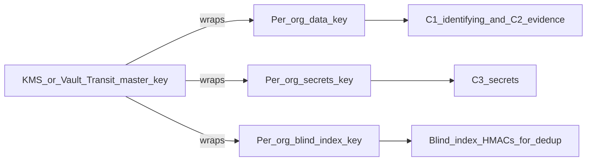
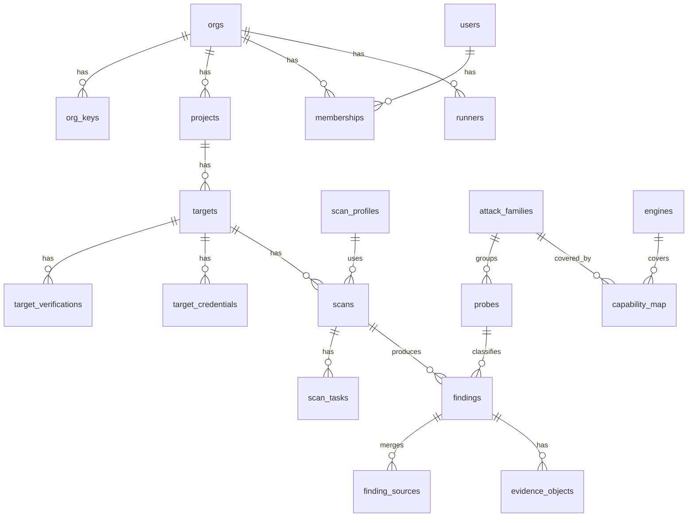

# Database Schema (security-first)

Cross-cutting. The foundation (roles, RLS, encryption, audit) lands in Phase 0; tenant, target, scan, and finding tables in Phase 1; the rest in the phase that first needs them (noted per table).
Parent: [00-master-plan.md](00-master-plan.md).

## Why this is security-critical
The database holds our customers' **actual, often unfixed vulnerabilities**: working attack payloads, the responses that prove them, leaked secrets, internal hostnames, and credentials for their test accounts. A copy of it is a ready-made attack plan against every customer at once. The design assumes a breach will eventually happen somewhere and limits what it yields.

| Threat | Main mitigation |
| --- | --- |
| Database dump or stolen backup | Every customer-supplied or customer-derived value is encrypted in the application with per-org keys held in KMS, never in the database. A dump without KMS access shows only ids, enums, and timestamps. |
| Our database becomes a copy of customer secrets | Secrets are kept by the customer where possible, stored write-only otherwise, and secrets found in evidence are redacted to a fingerprint before storage. |
| Bug in our API returns another org's rows | Postgres row-level security (RLS), forced on every tenant table, behind the application's own checks. |
| SQL injection in our API | Parameterized queries only; app roles cannot read key material, bypass RLS, or change schema. |
| Compromised worker | Worker role writes findings only for its task's org; cannot read users, audit, or other targets' credentials. |
| Insider or support staff | No standing staff access to evidence; time-boxed, customer-approved, audited grants. |
| Leak through side channels | No vulnerability payloads in logs, RabbitMQ messages, Valkey, Celery results, or error reports. |
| Tampering with history | Append-only, hash-chained audit log. |
| Org deletion leaves data in backups | Crypto-shredding: destroying the org's keys makes its ciphertext unrecoverable everywhere, backups included. |

## Platform
- **PostgreSQL 18** (native `uuidv7()`; PostgreSQL License). Managed Postgres in our cloud; same major version in the on-prem Helm chart.
- **Ids:** UUIDv7 everywhere. Time-ordered for index locality and not enumerable like serials. Authorization never relies on an id being unguessable.
- **Connections:** TLS with `sslmode=verify-full`. PgBouncer in transaction mode, so tenant context is set with `SET LOCAL` inside each transaction (a session-level `SET` would leak across pooled clients).
- **Extensions allowed:** `pgcrypto` (random bytes and digests only, not field encryption), `pgaudit`, `pg_stat_statements` (normalized queries; parameters never recorded). Nothing else without review.

## The plaintext rule
**No value that a customer typed, uploaded, or that we captured from a customer's system is stored in plaintext.** That includes names, URLs, hostnames, emails, IP addresses, free-text notes and audit metadata, not just evidence and secrets.

The only plaintext columns are values **Insidia itself generates** and that say nothing about the customer on their own:
- ids (UUIDv7) and foreign keys
- timestamps, counters, budgets, and numeric scores
- platform enums we define: severity, status, kind, track, mode, role, scope
- our own reference data: probe ids, attack families, taxonomy ids
- hashes, HMACs, blind indexes, and KMS-wrapped keys

A schema CI test enforces this. Every `text`, `text[]`, `citext`, `inet`, and `jsonb` column in a tenant table must either end in `_enc` or be listed in `schema/plaintext_allowlist.yaml` with a `CHECK` constraint restricting it to a fixed enum. Anything else fails the build. Adding a column to the allowlist needs security review.

## Data classification
Every column is assigned a class. The class decides which key encrypts it, where it may appear, and who can decrypt it. The class is recorded in a column comment (`COMMENT ON COLUMN ... IS 'class:C2'`) and a CI test fails if a column has no class.

| Class | Meaning | Examples | Storage | Logs, broker, cache |
| --- | --- | --- | --- | --- |
| C0 | Platform-generated metadata | ids, severity, status, timestamps, counts, probe ids | Plaintext (allowlisted only) | Allowed |
| C1 | Customer-identifying | org, project, and target names; URLs, hostnames, emails, IPs, user agents, audit metadata | Encrypted with the org data key; blind index where an exact-match lookup is needed | Ids only, never values |
| C2 | Vulnerability evidence | attack payload, target response, repro steps, gray-box context, tool traces | Encrypted with the org data key; secrets inside it are redacted first (see below) | Never |
| C3 | Customer secrets | direct-mode target credentials, webhook URLs, OAuth tokens | Not stored where avoidable (see [Customer secrets](#customer-secrets)). Otherwise encrypted with the separate per-org secrets key, write-only | Never |

Rules that follow from the classes:
- C1, C2, and C3 values are never written to Postgres logs, RabbitMQ messages, Valkey, Celery task arguments or results, error reports, or OpenTelemetry spans. Tasks pass ids; the worker loads and decrypts.
- The database never needs to search inside encrypted columns. Exact-match lookups (login by email, "does this host already have a verification") use blind indexes. Sorting and substring search on names happen in the API after decrypting the org's own rows; per-org row counts are small enough (hundreds of targets, not millions) for that to be cheap.
- Large C2 blobs (full transcripts, HTTP request/response pairs, screenshots) live in object storage, encrypted with the same org key. The database holds only a reference and a hash. Object keys contain only UUIDs, never names or hostnames.

## Customer secrets
The safest secret is one we never hold, so the options are used in this order of preference:

| Order | Approach | Where it applies | What we store |
| --- | --- | --- | --- |
| 1 | **Customer keeps it.** The runner reads the secret from its own environment or the customer's vault. | Runner mode (all targets) | Only a reference name, encrypted as C1 (for example `env:BOT_TOKEN`, `vault:kv/app#token`) |
| 2 | **Customer's cloud secret manager.** We hold a role that can read one secret at scan time, and the value is never written to our database. | Direct mode, customers on AWS, GCP, or Azure | The secret's ARN or path (C1, encrypted) and the role binding |
| 3 | **Short-lived tokens only.** The customer gives an OAuth client or a login flow, and we mint a token per scan, kept in worker memory and discarded afterwards. | Direct mode, OAuth or OIDC targets | The client secret (C3), never the minted tokens |
| 4 | **Stored, write-only.** Encrypted with the per-org secrets key. | Direct mode, static API keys or cookies | Ciphertext plus a non-reversible fingerprint |

Rules for every stored secret:
- **Write-only.** The API has no endpoint that returns a secret. The dashboard can replace or delete it, never read it back.
- **Masked display.** The UI shows the secret's kind, label, when it was set, and an 8-character fingerprint: the first 8 hex characters of `HMAC(secrets_key, value)`. The fingerprint lets a customer confirm "yes, that's the key I rotated" without showing any character of the secret. Stored secrets never show a prefix or last-4 characters.
- **Decrypted in one place.** Only the direct-mode egress proxy decrypts, only for a running scan, and it holds the value in memory for that scan only.
- **Expiry nudges.** Secrets older than 90 days are flagged in the dashboard for rotation.

Secrets that **Insidia issues** (API keys, session tokens, runner enrollment tokens) are never stored at all, not even encrypted:
- Tokens have the form `ins_<purpose>_<public_id>_<secret>`. The public id identifies the row and is safe to display. The secret part is 256 bits of randomness.
- We store only `HMAC-SHA256(server_pepper, secret)`. The pepper lives in KMS, so a database dump alone cannot be used to test guesses.
- User passwords use argon2id (memory 64 MiB, 3 iterations), also with the pepper.

### Secrets found in evidence
Targets often leak secrets in their responses: API keys in an error page, a connection string through a prompt injection. Storing that evidence as-is would make our database a copy of the customer's secrets. So before any evidence is persisted:
1. A secret detector (Insidia's own rules plus entropy checks) runs over the payload, the response, and the tool traces.
2. Each detected secret is replaced with a masked token: its type, length, and fingerprint, for example `[AWS_ACCESS_KEY len=20 fp=3f9a1c07]`. The raw value is dropped.
3. The finding keeps the fact that "an AWS key was exposed", its location, and the fingerprint. The customer can match the fingerprint against their own key to confirm which one to rotate.
4. `Authorization`, `Cookie`, `Set-Cookie`, `X-Api-Key`, and similar headers are removed from stored HTTP pairs, including the requests we sent.
5. PII (emails, phone numbers, card numbers) in responses is masked the same way by default. An org can turn on "keep raw PII in evidence" if they need it for a data-leak finding. The raw values are then still encrypted as C2, and the setting is audited.

## Encryption design (envelope encryption)

- **Master key** in cloud KMS (our cloud) or Vault Transit / customer HSM (on-prem). It never leaves the KMS; we call it only to wrap and unwrap.
- **Per-org keys**, three of them, each 256-bit, stored only in wrapped form in `org_keys`:
  - data key (DEK) for C1 and C2
  - secrets key for C3, kept separate so a bug that exposes evidence cannot also expose credentials
  - blind-index key for HMAC lookups (see below)
- **Cipher:** AES-256-GCM with a random 96-bit nonce per value. Stored format: `version(1) || key_version(4) || nonce(12) || ciphertext || tag(16)` in a `bytea` column.
- **Associated data (AAD):** `org_id || table || column || row_id`. A ciphertext copied into another row, column, or org fails to decrypt, so an attacker with write access cannot swap evidence between rows.
- **Platform keys:** a few values are not owned by one org, such as user emails (a user can belong to several orgs) and MFA secrets. They are encrypted with a platform data key and a platform blind-index key, both wrapped by the same KMS master key.
- **Where encryption happens:** in the application (`engine/api/crypto/`), never with `pgcrypto`. The database never sees plaintext C1/C2/C3 or any key, so a DB superuser, a dump, or a replica cannot read them.
- **Unwrapped keys** are cached in process memory only, for at most 5 minutes, and never written to disk, Valkey, or logs.
- **Rotation:** new data is always written with the newest `key_version`. A background job re-encrypts old rows in batches. Old key versions are kept (wrapped) until no row references them, then destroyed.
- **Crypto-shredding:** deleting an org destroys all its wrapped keys. Every C2/C3 value for that org, in the live database, replicas, backups, and object storage, becomes unreadable at once. Row deletion then runs as normal cleanup, not as the security guarantee.

### Blind indexes (search without decrypting)
Some lookups need to match a value without decrypting it: dedup of evidence, login by email, "is this host already verified". We store `HMAC-SHA256(blind_index_key, normalized_value)` next to the ciphertext. The HMAC is per org, so identical values in two orgs produce different results and cannot be correlated across tenants. Blind indexes support equality lookups only and are never returned by the API.

A blind index on a low-variety value (a country, a yes/no) would be trivially guessable, so blind indexes are only allowed on high-variety values: emails, hostnames, normalized evidence.

## Database roles (least privilege)
No application role owns tables, has `BYPASSRLS`, or is a superuser.

| Role | Used by | Can do |
| --- | --- | --- |
| `insidia_owner` | Migrations only (CI/CD job) | Owns schema. Not used at runtime. Login disabled outside migration windows. |
| `app_api` | FastAPI control plane | CRUD on tenant tables through RLS. No access to `org_keys` plaintext (there is none), `staff_*`, or audit updates. |
| `app_worker` | Celery workers | Insert findings, evidence refs, usage, task state for the envelope's org. Read targets and scans it is running. Cannot read users, memberships, api_keys, sessions. |
| `app_reports` | Report generation | Read-only on `v_findings_public` and taxonomy. Cannot see internal engine columns. |
| `app_audit` | API audit writer | `INSERT` only on `audit_events`. No `UPDATE`, `DELETE`, or `TRUNCATE`. |
| `app_keys` | Key service | Read/insert `org_keys`. Nothing else. |
| `app_admin_read` | Admin console API ([20-admin-console.md](20-admin-console.md)) | Read C0 columns across orgs only through `v_admin_*` views, plus the engine registry and aggregate stats. No base-table access. C1/C2 only via the key service with a staff role and, where required, an active `staff_access_grants` row. |
| `app_admin_write` | Admin console API | Insert/update `org_settings`, `org_feature_flags`, `feature_flags`, `staff_*`, and scan control commands. Nothing else. |
| `app_readonly_ops` | On-call dashboards | Metadata views (counts, queue health). No C1 values, no C2/C3. |

## Row-level security
Every table with an `org_id` gets the same pattern:
```sql
ALTER TABLE findings ENABLE ROW LEVEL SECURITY;
ALTER TABLE findings FORCE ROW LEVEL SECURITY;

CREATE POLICY tenant_isolation ON findings
  USING (org_id = current_setting('app.org_id', true)::uuid)
  WITH CHECK (org_id = current_setting('app.org_id', true)::uuid);
```
- `FORCE` applies the policy even to the table owner.
- `current_setting('app.org_id', true)` returns NULL when unset, so a missing tenant context matches **no rows** instead of erroring into a fallback path.
- The API and the Celery envelope middleware run `SET LOCAL app.org_id = '<uuid>'` at the start of every transaction. A test opens a transaction without it and asserts zero rows.
- Tables without `org_id` (engine registry, taxonomy, probes) are global reference data, read-only to app roles.

## Entity overview


Conventions for every tenant table below: `id uuid PRIMARY KEY DEFAULT uuidv7()`, `org_id uuid NOT NULL REFERENCES orgs(id)`, `created_at timestamptz NOT NULL DEFAULT now()`, RLS enabled and forced. These are omitted from each listing to keep it readable. Encrypted columns are `bytea` and end in `_enc`; blind indexes end in `_bidx`.

## Tables

### Tenancy and identity (Phase 0-2)
```sql
CREATE TABLE orgs (
  id            uuid PRIMARY KEY DEFAULT uuidv7(),
  name_enc      bytea NOT NULL,                -- C1, org data key
  region        text NOT NULL,                 -- C0, pinned at creation
  plan          text NOT NULL DEFAULT 'trial', -- C0
  retention_days int NOT NULL DEFAULT 180,     -- C0, evidence retention
  status        text NOT NULL DEFAULT 'active' CHECK (status IN ('active','suspended','deleting')),
  created_at    timestamptz NOT NULL DEFAULT now()
);

CREATE TABLE org_keys (
  org_id        uuid NOT NULL REFERENCES orgs(id),
  purpose       text NOT NULL CHECK (purpose IN ('data','secrets','blind_index')),
  key_version   int  NOT NULL,
  wrapped_key   bytea NOT NULL,                -- wrapped by KMS; plaintext never stored
  kms_key_ref   text NOT NULL,                 -- which master key wrapped it
  state         text NOT NULL CHECK (state IN ('active','decrypt_only','destroyed')),
  created_at    timestamptz NOT NULL DEFAULT now(),
  PRIMARY KEY (org_id, purpose, key_version)
);
-- Only app_keys may read org_keys. Destroying = overwrite wrapped_key and set state='destroyed'.

CREATE TABLE projects (
  name_enc bytea NOT NULL                      -- C1
);

CREATE TABLE users (
  id             uuid PRIMARY KEY DEFAULT uuidv7(),  -- global: a user can belong to several orgs
  email_enc      bytea NOT NULL,                     -- C1, platform data key
  email_bidx     bytea NOT NULL UNIQUE,              -- HMAC(platform index key, lowercase(email)); login lookup
  display_name_enc bytea,                            -- C1
  password_hash  text,                               -- argon2id + pepper; NULL for SSO-only users
  mfa_secret_enc bytea,                              -- C3, platform secrets key
  email_verified_at timestamptz,
  created_at     timestamptz NOT NULL DEFAULT now()
);

CREATE TABLE memberships (
  user_id uuid NOT NULL REFERENCES users(id),
  role    text NOT NULL CHECK (role IN ('owner','admin','member','viewer','custom')),
  permissions text[] NOT NULL DEFAULT '{}',          -- used when role='custom' (Phase 10)
  UNIQUE (org_id, user_id)
);

CREATE TABLE api_keys (
  name_enc    bytea NOT NULL,                        -- C1
  public_id   text NOT NULL UNIQUE,                  -- the <public_id> part of ins_api_<public_id>_<secret>; shown in UI
  secret_hmac bytea NOT NULL,                        -- HMAC(pepper, secret); the key itself is shown once, never stored
  scopes      text[] NOT NULL,                       -- C0, fixed scope enum
  last_used_at timestamptz,
  expires_at  timestamptz,
  revoked_at  timestamptz
);

CREATE TABLE sessions (
  user_id     uuid NOT NULL REFERENCES users(id),
  token_hmac  bytea NOT NULL UNIQUE,                 -- cookie holds the token; DB holds only HMAC(pepper, token)
  ip_enc      bytea,                                 -- C1
  user_agent_enc bytea,                              -- C1
  expires_at  timestamptz NOT NULL,
  revoked_at  timestamptz
);
```
`users` has no `org_id` and no tenant RLS. `app_api` reads it only through a `SECURITY DEFINER` function that returns users sharing an org with the caller. Login looks the user up by `email_bidx`, so the email is never compared in plaintext.

### Runners (Phase 1)
```sql
CREATE TABLE runners (
  name_enc      bytea NOT NULL,                      -- C1
  version       text,                                -- C0, our release version
  modes         text[] NOT NULL,                     -- {'relay','tunnel'}
  allowlist_hosts_enc bytea NOT NULL,                -- C1, JSON array; also enforced runner-side
  host_info_enc bytea,                               -- C1: OS, hostname, private IP reported by the runner
  status        text NOT NULL DEFAULT 'pending' CHECK (status IN ('pending','connected','offline','revoked')),
  last_heartbeat_at timestamptz,
  revoked_at    timestamptz
);

CREATE TABLE runner_enrollment_tokens (
  token_hmac  bytea NOT NULL UNIQUE,                 -- single use; HMAC(pepper, token)
  expires_at  timestamptz NOT NULL,                  -- short TTL, e.g. 1 hour
  used_at     timestamptz,
  created_by  uuid NOT NULL REFERENCES users(id)
);

CREATE TABLE runner_certs (
  runner_id    uuid NOT NULL REFERENCES runners(id),
  serial       text NOT NULL UNIQUE,
  fingerprint  bytea NOT NULL,                       -- SHA-256 of the client cert
  not_after    timestamptz NOT NULL,
  revoked_at   timestamptz
);
```
The hub checks `runner_certs.revoked_at` on every connection, so revoking a runner cuts it off immediately.

### Targets (Phase 1; gray-box context Phase 4)
```sql
CREATE TABLE targets (
  project_id    uuid NOT NULL REFERENCES projects(id),
  name_enc      bytea NOT NULL,                      -- C1
  connection    text NOT NULL CHECK (connection IN ('direct','runner')),
  runner_id     uuid REFERENCES runners(id),         -- required when connection='runner'
  mode          text NOT NULL CHECK (mode IN ('relay','tunnel')),
  kind          text NOT NULL CHECK (kind IN ('chat','rag','agent','web','api')),
  base_url_enc  bytea NOT NULL,                      -- C1
  hosts_enc     bytea NOT NULL,                      -- C1, JSON array of hosts the scan may reach
  transport     text NOT NULL CHECK (transport IN ('http','websocket','grpc','sse','sdk')),
  request_template_enc  bytea,                       -- C2: may embed internal field names
  response_selector_enc bytea,                       -- C1: reveals the response structure
  secret_ref_enc bytea,                              -- C1, runner mode: reference only, e.g. 'env:BOT_TOKEN'
  session_mode  text CHECK (session_mode IN ('stateless','cookie','conversation_id','custom')),
  rate_limit_rps int NOT NULL DEFAULT 5,
  max_concurrency int NOT NULL DEFAULT 8,
  CHECK ((connection = 'runner') = (runner_id IS NOT NULL))
);

CREATE TABLE target_verifications (                 -- direct mode ownership proof
  target_id   uuid NOT NULL REFERENCES targets(id),
  host_enc    bytea NOT NULL,                        -- C1
  host_bidx   bytea NOT NULL,                        -- exact-match lookup: "is this host verified?"
  method      text NOT NULL CHECK (method IN ('dns_txt','well_known_file','meta_tag')),
  challenge_hmac bytea NOT NULL,                     -- the token is shown once; we compare HMACs of what we fetch
  verified_at timestamptz,
  expires_at  timestamptz,                           -- re-verify every 30 days
  last_checked_at timestamptz
);

CREATE TABLE target_credentials (                   -- direct mode only; runner mode uses secret_ref_enc
  target_id   uuid NOT NULL REFERENCES targets(id),
  label       text NOT NULL CHECK (label IN ('identity_a','identity_b','identity_admin')), -- BOLA/BFLA pairs
  kind        text NOT NULL CHECK (kind IN ('header','cookie','basic','oauth_client','login_flow')),
  storage     text NOT NULL CHECK (storage IN ('stored','cloud_secret_ref','oauth_mint')),
  header_name_enc bytea,                             -- C1, e.g. 'Authorization'
  secret_enc  bytea,                                 -- C3, secrets key; NULL unless storage='stored' or 'oauth_mint'
  cloud_ref_enc bytea,                               -- C1: ARN/path in the customer's secret manager
  fingerprint text NOT NULL,                         -- first 8 hex of HMAC(secrets key, value); safe to display
  key_version int NOT NULL,
  rotated_at  timestamptz,
  CHECK ((storage = 'cloud_secret_ref') = (cloud_ref_enc IS NOT NULL AND secret_enc IS NULL))
);

CREATE TABLE target_contexts (                      -- gray-box inputs (Phase 4)
  target_id   uuid NOT NULL REFERENCES targets(id),
  kind        text NOT NULL CHECK (kind IN ('system_prompt','tool_schemas','purpose','documents','whitebox_bundle')),
  content_enc bytea,                                 -- C2 (small items)
  object_key  text,                                  -- C2 blob in object storage (large items)
  sha256      bytea NOT NULL
);
```
- A scan in direct mode is refused unless every host in `targets.hosts` has a `target_verifications` row with `verified_at` set and `expires_at` in the future. This is checked in the API **and** in the egress proxy.
- Only `app_worker` inside the direct egress proxy decrypts `target_credentials` or fetches `cloud_ref_enc`, and only for the scan being run. The dashboard can replace a credential but never read it back; it shows `kind`, `label`, `rotated_at`, and `fingerprint`.
- The egress proxy checks each outgoing request's host against the decrypted `hosts_enc` list and the `host_bidx` verifications, so direct-mode scope checks work even though hostnames are encrypted at rest.

### Engine registry and taxonomy (global reference data, Phase 1 and 3)
No `org_id`, no tenant RLS. Writable only by migrations (proposed from the admin console). These tables hold real engine names and must never be exposed through a customer-facing API or view.
```sql
CREATE TABLE engines (                              -- INTERNAL: real upstream names
  id          text PRIMARY KEY,                      -- 'garak', 'promptfoo', 'zap', ...
  track       text NOT NULL CHECK (track IN ('ai','classic','static','agent')),
  version     text NOT NULL,                         -- pinned image version
  image_digest text NOT NULL,
  license     text NOT NULL,                         -- ties to the attribution register
  enabled     boolean NOT NULL DEFAULT true
);

CREATE TABLE attack_families (                      -- customer-facing grouping
  id          text PRIMARY KEY,                      -- 'ai.jailbreak', 'ai.prompt_injection', 'web.xss'
  track       text NOT NULL,
  display_name text NOT NULL                         -- 'Jailbreak resistance'
);

CREATE TABLE capability_map (                       -- which engines cover which family
  engine_id        text NOT NULL REFERENCES engines(id),
  attack_family_id text NOT NULL REFERENCES attack_families(id),
  priority         int  NOT NULL,                    -- 1 = used in Standard mode
  module_label     text NOT NULL,                    -- 'Insidia Engine module 2': what customers see
  est_cost_per_attempt numeric,
  median_runtime_s int,
  precision_measured numeric,                        -- from the Phase 6 benchmark
  PRIMARY KEY (engine_id, attack_family_id)
);

CREATE TABLE probes (                               -- Insidia probe ids (public)
  id               text PRIMARY KEY,                 -- 'insidia.llm.jailbreak.roleplay'
  attack_family_id text NOT NULL REFERENCES attack_families(id),
  default_severity text NOT NULL,
  oracle           text NOT NULL,                    -- canary, tool_trace, goal_diff, ...
  requires_runner  boolean NOT NULL DEFAULT false    -- drives the direct/runner availability table
);

CREATE TABLE probe_upstream_map (                   -- INTERNAL: upstream probe name -> Insidia probe
  engine_id      text NOT NULL REFERENCES engines(id),
  upstream_probe text NOT NULL,                      -- e.g. 'dan.Dan_11_0'
  probe_id       text NOT NULL REFERENCES probes(id),
  PRIMARY KEY (engine_id, upstream_probe)
);

CREATE TABLE taxonomy_refs (
  id        text PRIMARY KEY,                        -- 'owasp-llm:LLM01', 'atlas:AML.T0051'
  framework text NOT NULL,
  version   text NOT NULL,
  title     text NOT NULL                            -- our own wording (CC BY-SA constraint)
);

CREATE TABLE probe_taxonomy (
  probe_id    text NOT NULL REFERENCES probes(id),
  taxonomy_id text NOT NULL REFERENCES taxonomy_refs(id),
  PRIMARY KEY (probe_id, taxonomy_id)
);
```
`app_api` and `app_worker` can read `attack_families`, `probes`, `taxonomy_refs`, `probe_taxonomy`, and `capability_map.module_label` through a view. Only `app_worker` (normalizer) and `app_admin_read` can read `engines` and `probe_upstream_map`.

### Scans (Phase 1; schedules Phase 9)
```sql
CREATE TABLE scan_profiles (                        -- org_id NULL = built-in profile
  org_id       uuid REFERENCES orgs(id),
  name_enc     bytea,                                -- C1 for org profiles
  builtin_name text,                                 -- C0, only for built-in profiles (our wording)
  probe_ids    text[] NOT NULL,                      -- C0, our probe ids
  default_coverage text NOT NULL DEFAULT 'standard' CHECK (default_coverage IN ('standard','thorough','custom')),
  CHECK ((org_id IS NULL) = (builtin_name IS NOT NULL AND name_enc IS NULL))
);
-- Exception to the standard policy: built-in profiles (org_id NULL) are readable by every org, writable by none.
-- USING (org_id IS NULL OR org_id = current_setting('app.org_id', true)::uuid)
-- WITH CHECK (org_id = current_setting('app.org_id', true)::uuid)

CREATE TABLE scans (
  project_id    uuid NOT NULL REFERENCES projects(id),
  target_id     uuid NOT NULL REFERENCES targets(id),
  profile_id    uuid NOT NULL REFERENCES scan_profiles(id),
  launched_by   uuid REFERENCES users(id),           -- NULL for scheduled/CI scans
  trigger       text NOT NULL CHECK (trigger IN ('dashboard','api','ci','schedule')),
  connection    text NOT NULL,                       -- copied from target at launch
  test_mode     text NOT NULL CHECK (test_mode IN ('black','gray','white')),
  coverage_mode text NOT NULL CHECK (coverage_mode IN ('standard','thorough','custom')),
  state         text NOT NULL DEFAULT 'queued' CHECK (state IN
                ('queued','running','paused_budget','cancelled','failed','completed')),
  max_attempts  int NOT NULL,
  max_tokens    bigint NOT NULL,
  max_wall_clock interval NOT NULL,
  estimated_cost numeric,                            -- shown before launch
  started_at    timestamptz,
  finished_at   timestamptz,
  kill_switch   boolean NOT NULL DEFAULT false,
  config_snapshot jsonb NOT NULL,                    -- C0: effective settings resolved at launch (registry-typed values only)
  config_hash   bytea NOT NULL                       -- SHA-256 of the canonical snapshot
);

CREATE TABLE scan_family_coverage (                 -- per-family choice when coverage_mode='custom'
  scan_id          uuid NOT NULL REFERENCES scans(id),
  attack_family_id text NOT NULL REFERENCES attack_families(id),
  coverage         text NOT NULL CHECK (coverage IN ('standard','thorough','skip')),
  PRIMARY KEY (scan_id, attack_family_id)
);

CREATE TABLE scan_tasks (                           -- one row per Celery task; durable task state
  scan_id       uuid NOT NULL REFERENCES scans(id),
  celery_task_id text NOT NULL UNIQUE,
  queue         text NOT NULL,
  engine_id     text NOT NULL REFERENCES engines(id), -- INTERNAL
  attack_family_id text NOT NULL REFERENCES attack_families(id),
  state         text NOT NULL CHECK (state IN ('queued','running','retrying','succeeded','failed','cancelled')),
  attempts_done int NOT NULL DEFAULT 0,
  error_code    text,                                -- C0, our error enum only, never raw engine output
  started_at    timestamptz,
  finished_at   timestamptz
);

CREATE TABLE scan_schedules (                       -- Phase 9
  target_id   uuid NOT NULL REFERENCES targets(id),
  profile_id  uuid NOT NULL REFERENCES scan_profiles(id),
  cron        text NOT NULL,
  coverage_mode text NOT NULL,
  fail_on     text[] NOT NULL DEFAULT '{critical,high}',
  enabled     boolean NOT NULL DEFAULT true,
  last_enqueued_at timestamptz
);
```
Celery's own result backend stores only `{status, finding_count}`. Tasks never return evidence. `result_expires` is 1 hour; `scan_tasks` is the durable record.

### Findings and evidence (Phase 1; baselines Phase 9)
The most sensitive tables. Plaintext columns are only what the dashboard filters and sorts on.
```sql
CREATE TABLE findings (
  project_id      uuid NOT NULL REFERENCES projects(id),
  target_id       uuid NOT NULL REFERENCES targets(id),
  first_scan_id   uuid NOT NULL REFERENCES scans(id),
  last_scan_id    uuid NOT NULL REFERENCES scans(id),
  probe_id        text NOT NULL REFERENCES probes(id),         -- C0, public Insidia id
  attack_family_id text NOT NULL REFERENCES attack_families(id),
  track           text NOT NULL CHECK (track IN ('ai','classic')),
  severity        text NOT NULL CHECK (severity IN ('critical','high','medium','low','info')),
  confidence      numeric(3,2) NOT NULL,                       -- 0.00-1.00
  oracle          text NOT NULL,                               -- C0, oracle enum
  oracle_pass     boolean NOT NULL,
  cross_validated boolean NOT NULL DEFAULT false,              -- confirmed by 2+ engine modules
  exposed_secret_types text[] NOT NULL DEFAULT '{}',           -- C0, e.g. {'aws_access_key'}; values are never stored
  exposed_secret_fps   text[] NOT NULL DEFAULT '{}',           -- fingerprints of redacted secrets, for customer matching
  cvss_vector     text,                                        -- C0, standard CVSS vector string
  aivss_score     numeric,
  status          text NOT NULL DEFAULT 'open' CHECK (status IN
                  ('open','accepted','fixed','false_positive','baselined')),
  title_enc       bytea NOT NULL,                              -- C2: titles can name internal endpoints
  attack_enc      bytea NOT NULL,                              -- C2: the working payload
  response_enc    bytea,                                       -- C2: redacted proof
  repro_enc       bytea,                                       -- C2: step-by-step reproduction
  remediation_enc bytea,                                       -- C2
  key_version     int NOT NULL,
  evidence_bidx   bytea NOT NULL,                              -- HMAC of normalized evidence, for dedup
  evidence_sha256 bytea NOT NULL,                              -- integrity of the decrypted evidence
  first_seen_at   timestamptz NOT NULL DEFAULT now(),
  last_seen_at    timestamptz NOT NULL DEFAULT now(),
  UNIQUE (org_id, target_id, attack_family_id, evidence_bidx) -- cross-engine dedup key
);

CREATE TABLE finding_sources (                      -- INTERNAL: each engine result merged into a finding
  finding_id     uuid NOT NULL REFERENCES findings(id),
  scan_task_id   uuid NOT NULL REFERENCES scan_tasks(id),
  engine_id      text NOT NULL REFERENCES engines(id),
  upstream_probe text NOT NULL,                               -- internal reference data, not customer data
  raw_object_id  uuid                                         -- evidence_objects row holding the raw engine output (C2)
);

CREATE TABLE finding_taxonomy (
  finding_id  uuid NOT NULL REFERENCES findings(id),
  taxonomy_id text NOT NULL REFERENCES taxonomy_refs(id),
  PRIMARY KEY (finding_id, taxonomy_id)
);

CREATE TABLE finding_status_history (               -- who changed what, when
  finding_id  uuid NOT NULL REFERENCES findings(id),
  from_status text NOT NULL,                                   -- C0, status enum
  to_status   text NOT NULL,                                   -- C0, status enum
  changed_by  uuid REFERENCES users(id),
  note_enc    bytea                                            -- C2: justification can reveal context
);

CREATE TABLE evidence_objects (                     -- large blobs live in object storage
  finding_id  uuid REFERENCES findings(id),
  scan_id     uuid NOT NULL REFERENCES scans(id),
  kind        text NOT NULL CHECK (kind IN ('transcript','http_pair','screenshot','tool_trace','raw_engine')),
  object_key  text NOT NULL,                                   -- org/{org_id}/scans/{scan_id}/{uuid}
  sha256      bytea NOT NULL,
  size_bytes  bigint NOT NULL,
  key_version int NOT NULL,
  expires_at  timestamptz NOT NULL                             -- created_at + org retention
);

CREATE TABLE baselines (                            -- Phase 9 regression gating
  target_id     uuid NOT NULL REFERENCES targets(id),
  finding_id    uuid NOT NULL REFERENCES findings(id),
  set_by        uuid NOT NULL REFERENCES users(id),
  UNIQUE (org_id, target_id, finding_id)
);
```
- The dedup key uses the blind index, so the database can merge findings from several engines without ever holding plaintext evidence.
- `finding_sources` and `scan_tasks.engine_id` are the only places tying a finding to a real engine. Neither is in any customer-facing view.

### Reports, usage, integrations (Phases 2, 3, 9)
```sql
CREATE TABLE reports (
  scan_id     uuid REFERENCES scans(id),
  framework   text NOT NULL,                        -- 'owasp-llm-2026', 'eu-ai-act-art15', ...
  format      text NOT NULL CHECK (format IN ('pdf','html','sarif','json','evidence_pack')),
  object_key  text NOT NULL,                        -- encrypted blob
  sha256      bytea NOT NULL,
  requested_by uuid REFERENCES users(id),
  expires_at  timestamptz NOT NULL                  -- download links expire; regenerate on demand
);

CREATE TABLE usage_events (
  scan_id    uuid REFERENCES scans(id),
  kind       text NOT NULL CHECK (kind IN ('attempt','model_token','tunnel_byte','egress_byte')),
  amount     bigint NOT NULL
) PARTITION BY RANGE (created_at);                  -- monthly partitions

CREATE TABLE notification_channels (
  kind       text NOT NULL CHECK (kind IN ('slack','webhook','email','jira','siem')),
  name_enc   bytea NOT NULL,                        -- C1
  config_enc bytea NOT NULL,                        -- C3: URLs and tokens are credentials; write-only
  fingerprint text NOT NULL,                        -- masked display, same scheme as target_credentials
  include_evidence boolean NOT NULL DEFAULT false,  -- off by default: Slack is not a vault
  key_version int NOT NULL
);
```

### Audit and staff access (Phase 0 foundation, Phase 10 full)
```sql
CREATE TABLE audit_events (
  seq          bigint GENERATED ALWAYS AS IDENTITY,
  org_id       uuid NOT NULL,
  actor_type   text NOT NULL CHECK (actor_type IN ('user','api_key','runner','system','staff')),
  actor_id     uuid,
  action       text NOT NULL,                       -- 'scan.launch', 'finding.status', 'credential.replace', ...
  target_type  text,                                -- C0, entity enum
  target_id    uuid,
  ip_enc       bytea,                               -- C1
  metadata_enc bytea,                               -- C1: before/after values of changed settings; never C2/C3
  key_version  int NOT NULL,
  prev_hash    bytea NOT NULL,
  row_hash     bytea NOT NULL,                      -- SHA-256(prev_hash || canonical row, ciphertext included)
  created_at   timestamptz NOT NULL DEFAULT now(),
  PRIMARY KEY (org_id, seq)
) PARTITION BY RANGE (created_at);
-- REVOKE UPDATE, DELETE, TRUNCATE ON audit_events FROM PUBLIC and every app role.
-- A BEFORE UPDATE OR DELETE trigger raises an exception as a second guard.

CREATE TABLE staff_access_grants (                  -- no standing staff access to evidence
  org_id        uuid NOT NULL REFERENCES orgs(id),
  staff_user_id uuid NOT NULL REFERENCES staff_users(id),
  approved_by   uuid NOT NULL REFERENCES users(id), -- a customer owner/admin
  reason_enc    bytea NOT NULL,                     -- C1: support tickets often quote the customer's issue
  scope         text NOT NULL CHECK (scope IN ('metadata','evidence')),
  starts_at     timestamptz NOT NULL,
  ends_at       timestamptz NOT NULL,               -- max 72 hours
  revoked_at    timestamptz,
  CHECK (ends_at - starts_at <= interval '72 hours')
);
```
- Audit metadata is encrypted with the org data key, so crypto-shredding an org also erases its audit detail. The hash chain still verifies, because it is computed over ciphertext.
- The audit writer passes metadata through the same secret redactor as evidence, so an audit row for "credential replaced" records the fingerprint, never the value.
- The hash chain makes silent edits or deletions detectable: a nightly job re-computes the chain per org and alerts on a break. The latest `row_hash` per org is also copied to write-once object storage daily, so an attacker with DB access cannot rewrite the whole chain undetected.
- Staff evidence decryption goes through the key service, which checks for an active grant, and every decryption writes an `audit_events` row with `actor_type='staff'` that the customer can see.

### Admin console tables
Used by the internal admin console ([20-admin-console.md](20-admin-console.md)). Staff identity is separate from customer `users`.
```sql
CREATE TABLE staff_users (                          -- global, no org_id
  id            uuid PRIMARY KEY DEFAULT uuidv7(),
  sso_subject_bidx bytea NOT NULL UNIQUE,           -- HMAC of the staff IdP subject
  email_enc     bytea NOT NULL,                     -- C1, platform data key
  totp_secret_enc bytea,                            -- C3, platform secrets key; NULL until enrolled
  totp_last_step bigint,                            -- last accepted TOTP time step (replay protection)
  recovery_code_hmacs bytea[],                      -- HMAC(pepper, code); single-use, removed when used
  failed_totp_count int NOT NULL DEFAULT 0,
  locked_until  timestamptz,
  disabled_at   timestamptz,
  created_at    timestamptz NOT NULL DEFAULT now()
);

CREATE TABLE staff_role_assignments (
  staff_user_id uuid NOT NULL REFERENCES staff_users(id),
  role          text NOT NULL CHECK (role IN ('support','ops','engineer','admin','security')),
  granted_by    uuid NOT NULL REFERENCES staff_users(id),
  approval_id   uuid NOT NULL,                      -- staff_approvals row (two-person rule)
  created_at    timestamptz NOT NULL DEFAULT now(),
  revoked_at    timestamptz,
  PRIMARY KEY (staff_user_id, role, created_at)
);

CREATE TABLE feature_flags (                        -- global flag definitions
  key           text PRIMARY KEY,                   -- C0, our flag names
  default_on    boolean NOT NULL DEFAULT false,
  description   text NOT NULL                       -- C0, our wording
);

CREATE TABLE org_feature_flags (                    -- per-org overrides
  org_id        uuid NOT NULL REFERENCES orgs(id),
  flag_key      text NOT NULL REFERENCES feature_flags(key),
  enabled       boolean NOT NULL,
  set_by        uuid NOT NULL REFERENCES staff_users(id),
  updated_at    timestamptz NOT NULL DEFAULT now(),
  PRIMARY KEY (org_id, flag_key)
);

CREATE TABLE org_settings (                         -- per-org overrides of registry-typed settings
  org_id        uuid NOT NULL REFERENCES orgs(id),
  setting_key   text NOT NULL,                      -- C0, must exist in settings_registry.py (CI-checked)
  value         jsonb,                              -- C0: number, boolean, or enum from the registry; NULL when value_enc is used
  value_enc     bytea,                              -- C1 for customer-supplied values (report branding)
  set_by_type   text NOT NULL CHECK (set_by_type IN ('staff','user')),
  set_by        uuid NOT NULL,
  updated_at    timestamptz NOT NULL DEFAULT now(),
  PRIMARY KEY (org_id, setting_key),
  CHECK ((value IS NULL) <> (value_enc IS NULL))
);

CREATE TABLE staff_approvals (                      -- two-person rule
  id            uuid PRIMARY KEY DEFAULT uuidv7(),
  action        text NOT NULL,                      -- C0, enum of guarded actions
  org_id        uuid REFERENCES orgs(id),
  payload_enc   bytea NOT NULL,                     -- C1: the proposed change, platform data key
  proposed_by   uuid NOT NULL REFERENCES staff_users(id),
  approved_by   uuid REFERENCES staff_users(id),
  expires_at    timestamptz NOT NULL,               -- 24 hours after proposal
  decided_at    timestamptz,
  CHECK (approved_by IS NULL OR approved_by <> proposed_by)
);

CREATE TABLE staff_audit_events (                   -- internal; same hash chain as audit_events
  seq          bigint GENERATED ALWAYS AS IDENTITY PRIMARY KEY,
  staff_user_id uuid NOT NULL REFERENCES staff_users(id),
  action       text NOT NULL,                       -- 'org.view', 'setting.change', 'decrypt.contact', 'scan.cancel', ...
  org_id       uuid,
  target_type  text,
  target_id    uuid,
  metadata_enc bytea,                               -- C1, platform data key; before/after, reason; never C2/C3
  prev_hash    bytea NOT NULL,
  row_hash     bytea NOT NULL,
  created_at   timestamptz NOT NULL DEFAULT now()
) PARTITION BY RANGE (created_at);
```
- `org_settings.value` is plaintext JSON only because every key and allowed value comes from our typed registry (numbers, booleans, enums). A CI test fails if a registry entry accepts free text without `value_enc`.
- `v_admin_*` views expose C0 columns across orgs for `app_admin_read` (for example `v_admin_orgs`, `v_admin_scans`, `v_admin_scan_tasks`, `v_admin_runners`). They never include `_enc` columns; decryption is a separate key-service call.
- `staff_audit_events` follows the same append-only rules as `audit_events`. Customer-affecting staff actions also write a customer-visible `audit_events` row.

## Customer-facing views
The API and report roles read findings only through views that cannot leak engine identity:
```sql
CREATE VIEW v_findings_public WITH (security_barrier = true, security_invoker = true) AS
SELECT f.id, f.org_id, f.project_id, f.target_id, f.last_scan_id,
       f.probe_id, f.attack_family_id, f.track, f.severity, f.confidence,
       f.oracle, f.cross_validated, f.cvss_vector, f.aivss_score, f.status,
       f.exposed_secret_types, f.exposed_secret_fps,
       f.title_enc, f.attack_enc, f.response_enc, f.repro_enc, f.remediation_enc,
       f.key_version, f.first_seen_at, f.last_seen_at
FROM findings f;                                   -- no finding_sources, no engine columns

CREATE VIEW v_scan_progress WITH (security_barrier = true, security_invoker = true) AS
SELECT t.scan_id, t.org_id, t.attack_family_id, cm.module_label,
       count(*) FILTER (WHERE t.state = 'succeeded') AS done,
       count(*) AS total
FROM scan_tasks t
JOIN capability_map cm ON cm.engine_id = t.engine_id AND cm.attack_family_id = t.attack_family_id
GROUP BY t.scan_id, t.org_id, t.attack_family_id, cm.module_label;  -- module labels only
```
`security_invoker` makes the view run with the caller's privileges, so RLS still applies. `app_api` and `app_reports` have no `SELECT` on `findings`, `finding_sources`, `scan_tasks`, `engines`, or `probe_upstream_map` directly.

## Retention and deletion
| Data | Default | Configurable | How it is removed |
| --- | --- | --- | --- |
| Evidence blobs and C2 fields | 180 days after the scan | Per org, 30-730 days | Nightly job deletes objects and nulls `*_enc` columns; the finding metadata stays |
| Baselined findings' evidence | Kept while baselined | - | Removed when the baseline is cleared, then normal retention |
| Findings metadata (C0/C1) | 2 years | Per org | Nightly job |
| Reports | 30 days | Per org | Object lifecycle rule + row delete |
| Audit events | 1 year minimum | Up to 7 years | Partition drop after archive export |
| Usage events | 2 years | No (billing) | Partition drop |
| Whole org | On request | - | Crypto-shred keys immediately, then delete rows and objects within 30 days |

Backups are encrypted with a backup key separate from the org keys, kept 35 days, and restore-tested quarterly. Because C2/C3 inside a backup are still encrypted with org keys, a shredded org stays unreadable even in older backups.

## Operational hardening
- **Postgres logging:** `log_statement = 'none'`, `log_min_duration_statement` with parameters disabled, `log_parameter_max_length = 0`, `log_parameter_max_length_on_error = 0`. Error logs therefore never contain a payload that failed to insert.
- **pgaudit:** logs DDL and role changes, and reads on `org_keys`, `target_credentials`, and `staff_access_grants`. It records statement class, not parameter values.
- **Network:** the database has no public endpoint. Only the API, workers, key service, and migration job can reach it, on private subnets.
- **Encryption at rest** (storage level) is on as a baseline, but it is not the control we rely on; the application-level encryption above is.
- **Migrations:** reviewed like code. A migration that adds a column without a class comment, adds a table with `org_id` but no forced RLS policy, or grants `SELECT` on internal tables to a customer-facing role fails CI.
- **Read replicas and analytics** receive only C0 columns through a filtered logical replication publication. No encrypted columns are replicated to analytics, even as ciphertext.
- **Object storage:** buckets are private, versioned, and encrypted server-side as a baseline. Every object is also encrypted by the application with the org data key before upload. Presigned download URLs last 5 minutes and are generated only after an authorization check.

## Tests (required before each phase exit)
- Two-org test on every tenant table: org B's session sees zero of org A's rows, including through every view.
- A transaction with no `app.org_id` sees zero rows everywhere.
- Ciphertext moved to another row or org fails to decrypt (AAD check).
- `pg_dump` of a seeded database contains none of the planted canary values: org, project, and target names, hostnames, URLs, emails, IPs, evidence, credentials, webhook URLs, and audit metadata.
- The plaintext-allowlist test: every text-like column in a tenant table is either `_enc` or allowlisted with an enum `CHECK`.
- Secret redaction: a response containing planted AWS, GitHub, Stripe, JWT, and private-key canaries is stored with masked tokens only; neither the database nor object storage contains the raw values.
- Stored HTTP pairs contain no `Authorization`, `Cookie`, or `Set-Cookie` values.
- No API endpoint returns a secret: a contract test calls every route and scans responses for the planted credential canaries.
- A dump of `api_keys`, `sessions`, and `runner_enrollment_tokens` cannot authenticate: the HMACs need the KMS-held pepper.
- Log capture during a forced insert failure contains no payload.
- `app_api` cannot select from `findings`, `finding_sources`, `engines`, or `org_keys`.
- Audit table rejects `UPDATE` and `DELETE`; the chain verifier detects a manually edited row.
- Crypto-shred: after destroying an org's keys, its findings cannot be decrypted from a restored backup.
- Denylist: no upstream engine name appears in any row returned by a customer-facing view.
- `app_admin_read` cannot select any base table; `v_admin_*` views return no `_enc` columns; a staff decryption of C1 or C2 without the required grant fails.

## Open decisions
- KMS product per environment (cloud KMS in our SaaS; Vault Transit vs customer HSM for on-prem) is chosen at Phase 10, but the key-service interface is fixed in Phase 0 so the choice does not change application code.
- Whether gray-box `target_contexts` should use a third key separate from evidence. Default: same data key, revisit if a customer requires it.
