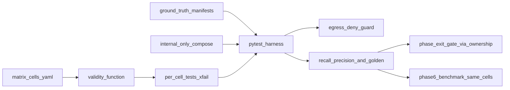

# Phase T — Test harness (done) and the public scanner benchmark

> **v6. Status: done, and now public.** The harness, the matrix, and the sandboxed targets move to `benchmark/` in Phase 1.0 and are published so anyone can score a scanner, including ours. The ownership map still uses v5 phase numbers until that move remaps it. The v6 homes are in the table below and in [00-master-plan.md](00-master-plan.md#phase-mapping-from-v5). The CLI is a driver, not a new connection mode: a local scan still uses direct, relay, tunnel, or the SDK bridge to reach the target.

Depends on: Phase 0 scaffold. Blocks: the exit of every build phase.
Parent: [00-master-plan.md](00-master-plan.md). Targets and thresholds are shared with [16-coverage-gaps.md](16-coverage-gaps.md) and the registry benchmark ([08-phase6-engine-registry.md](08-phase6-engine-registry.md)).

## Intent
Before a feature is built, its acceptance test exists. For every valid combination of connector, box mode, attack type, and connection mode, there is a sandboxed target with a **known planted vulnerability**, the exact permutation cell it exercises, and a **pass threshold** (minimum recall and precision against ground truth). Tests are written first, run red (xfail), and must flip to green for the owning phase to exit. This is the `tdd-guide` rule applied to the whole product, and it gives us a threshold to build toward instead of a vague "does it work".

The same targets and ground truth power the Phase 6 benchmark and the coverage-gap validation, so there is one source of truth, not three.

## The permutation matrix
The matrix is a generated registry, not a hand-drawn grid, so it stays complete as families are added. Four dimensions:

- **Connector / target kind** (from `targets.kind` in [14-database-schema.md](14-database-schema.md)):
  - chat: HTTP JSON template, OpenAI-compatible, Anthropic, Bedrock, Azure, WebSocket/streaming
  - rag
  - agent (tool-using, MCP)
  - multi-agent / A2A
  - web
  - api: REST, GraphQL, gRPC, WebSocket
  - SDK in-process handler
- **Box mode:** black, gray, white.
- **Attack type:**
  - AI families 3.1–3.11 from [01-ai-redteam-coverage-spec.md](01-ai-redteam-coverage-spec.md)
  - classic families: SQLi, XSS, command injection, SSTI, path/LFI, SSRF, deserialization, XXE, BOLA/IDOR, BFLA, mass assignment, auth (JWT/OAuth/session), race conditions, request smuggling, client-side, SAST sinks, secrets, SCA, infra CVE, TLS
- **Connection mode:** direct (sandboxed "public"), runner relay, runner tunnel, SDK bridge.

### Validity function (impossible cells are N/A, with a reason)
Encoded once in `tests/matrix/validity.py`:
- White box needs code access, so it is valid only through runner `extract`, source upload, or the SDK; N/A for direct-only hosted targets.
- Gray box needs a context object (system prompt, tool schemas, purpose, or a whitebox bundle); N/A when none applies.
- Attack types are scoped to compatible connectors: XSS and client-side to web; BOLA/BFLA/mass assignment to api and web; RAG poisoning to rag; tool misuse, sandbox escape, and approval bypass to agent; A2A spoof and cascade to multi-agent; SAST/secrets/SCA to code-bearing (white box) cells.
- Runner-only capabilities (localhost targets, `extract`, `discover`, SDK) are N/A for the direct connection mode, matching the feature table in [00-master-plan.md](00-master-plan.md).

Every valid cell gets exactly one ground-truth test. Every N/A cell is recorded with its reason. A completeness test asserts the union of valid and N/A equals the full cross-product, so no permutation is silently missing. The full function and the matrix rendered as projection tables (attack x connector, connector x connection mode, box-mode support, and a worked `web` example) are in [18-validity-matrix.md](18-validity-matrix.md).

## Sandboxed, local-only targets (`tests/targets/`)
OSS vulnerable apps, self-hosted and pinned by image digest:

| Target | License | Covers |
| --- | --- | --- |
| OWASP Juice Shop | MIT | web: XSS, SQLi, auth, access control, client-side |
| crAPI | Apache-2.0 | REST API: BOLA, BFLA, mass assignment, JWT, SSRF |
| VAmPI | MIT | REST API: auth, IDOR, injection (small, fast smoke) |
| Damn Vulnerable GraphQL Application | MIT | GraphQL: introspection, batching, injection, authz |
| AgentDojo | MIT | agent: tool misuse, indirect injection, goal hijack |

Our own fixtures for cells the OSS apps do not cover (`tests/targets/insidia/`):
- vulnerable chatbot (canary leak, jailbreak, hidden-context extraction)
- RAG app with a plantable corpus (poisoning, cross-doc smuggling, tenant bleed)
- MCP agent with dangerous tools (tool-chain, sandbox sensors, approval flag)
- two-agent A2A system (spoofed message, cascade)
- gRPC and WebSocket API fixtures
- repo fixture with planted secrets and SAST sinks (white box)

### Sandbox rules (public APIs run local-only)
- One Docker Compose project on a network with `internal: true`. Targets have **no internet egress**. An egress-deny assertion runs a canary outbound call from each target container and fails the suite if it succeeds.
- The direct connection mode is exercised against these local copies with local DNS overrides and a verification stub, so ownership verification and the egress proxy (private-range blocking, verified-host enforcement) are tested end to end without touching any real host.
- No target on the public internet is ever scanned by the suite. CI enforces this with the egress-deny check, not just policy.
- Fixtures are reset to a known state before each cell so stateful attacks (race, mass assignment) are deterministic.

## Ground truth and thresholds
- Each target ships `ground_truth.yaml`: every planted vulnerability, its location, the mapped Insidia Labs probe id and taxonomy id, and severity.
- Each cell asserts **detection thresholds** against that ground truth:
  - recall: the cell must catch its planted vulnerabilities (default floor 80%, and 100% for the single planted issue in a focused cell)
  - precision: bounded false positives (default floor 90%)
  matching the bar in [16-coverage-gaps.md](16-coverage-gaps.md#validating-this-analysis).
- Oracles are deterministic wherever possible (canary, tool-trace, structural sink, ACL), per [06-phase4-depth.md](06-phase4-depth.md). Judge-only cells record confidence and cannot alone assert a critical finding.
- Golden result files per cell provide regression detection alongside the absolute thresholds: a drop from the golden set fails even if the threshold is still met.

## Harness (`tests/`)
```
tests/
  matrix/
    cells.yaml          generated registry of every cell
    validity.py         valid vs N/A with reasons
    completeness_test.py
    ownership.yaml      cell -> owning phase (drives the gate)
  targets/
    juiceshop/ crapi/ vampi/ dvga/ agentdojo/
    insidia/            our fixtures
    <each>/ground_truth.yaml
  harness/
    sandbox.py          brings up the internal-only compose, resets state
    run_cell.py         enroll runner or use direct/SDK path, run scan, collect findings
    score.py            recall/precision vs ground truth, golden diff
    egress_guard.py     asserts no target reached the internet
  cells/                one test per valid cell (xfail until built)
  golden/               per-cell golden findings
```
- `pytest` driver. Reuses Phase 1 fixtures (`engine/workers/ai/testdata/`) and is the single source the Phase 6 benchmark reads.
- Markers per dimension (`-m "connector_web and blackbox and sqli"`) so a phase or a developer runs its slice.

## Gate mechanism
- **Phase T deliverable:** the harness, the sandbox, the matrix registry, the validity function, the ground-truth manifests, and every cell test written and passing as xfail. No product code is required for Phase T to exit; the tests define the threshold the product must later meet.
- **Per-phase gate:** `tests/matrix/ownership.yaml` maps each cell to the phase that builds it. A CI check fails a phase's PRs if a cell it owns is still xfail at that phase's exit. Each phase plan's Exit section gains one line: "owned matrix cells are green."
- **CI cadence:** the affected slice per PR; the full matrix nightly and on every engine version bump (shared with the Phase 6 benchmark run).



## Ownership by phase
`ownership.yaml` keeps the v5 numbers until Phase 1.0 remaps it. Read the v5 number, then use this table.

| v5 owner in `ownership.yaml` | v6 owner |
| --- | --- |
| Phase 1: chat black-box, web and API black-box, canary, SQLi, XSS | 1B |
| Phase 3: taxonomy tags on existing cells | 1D |
| Phase 4A deterministic: RAG, indirect injection, memory, output sinks | 1C |
| Phase 4A model-driven: generated multi-turn variants | 2B |
| Phase 4B: BOLA/BFLA, JWT, GraphQL, gRPC, SAST for Python and JS/TS | 1B and 1C |
| Phase 5: the chained AI-to-classic exploit (its own exit test, not a matrix attack) | 2B |
| Phase 7 scripted: tool misuse on a declared tool list | 1C |
| Phase 7 depth: honeypots, multi-agent, A2A | Phase 3 |
| Phase 8 static scanners | 1B |
| Phase 8 AI-BOM, SDK, embedding exposure | Phase 3 |
| Phase 9: race conditions and `api_ws` | 1B |
| Phase 11: predictive ML, smuggling, client-side | Phase 3 |

## Tests (of the harness itself)
- Completeness: valid + N/A equals the full cross-product.
- Validity reasons: every N/A cell has a machine-readable reason.
- Egress guard: a fixture that tries to call out is caught and fails the suite.
- Scoring: a synthetic findings set produces the expected recall and precision.
- Ownership: every valid cell maps to exactly one phase.

## Risks
- **Matrix size.** Thousands of cells if taken naively. The validity function collapses it to the valid set, and markers let phases run only their slice; the full run is nightly, not per-PR.
- **Flaky OSS targets.** Pin digests, reset state per cell, and quarantine a target behind a marker if upstream breaks, rather than letting it redden unrelated cells.
- **Ground-truth drift.** When a target image is bumped, its `ground_truth.yaml` is re-reviewed in the same PR; the loader fails if a planted id has no mapping.
- **Sandbox escape of the test targets themselves.** Deliberately vulnerable apps run only on the internal network with no egress and no host mounts, and never in production clusters.
